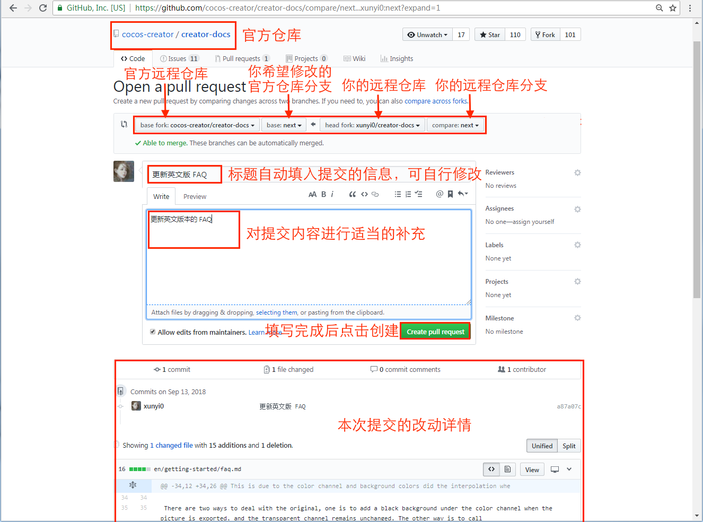

### 欢迎来到GitHub的世界

## 什么是GitHub

GitHub是为开发者提供Git仓库的托管服务。这是一个让开发者与朋友、同事、同学及陌生人共享代码的完美场所。 

GitHub公司总部位于美国旧金山，拥有一只不知是章鱼还是猫的吉祥物octocat。如下图：

GitHub除提供Git仓库的托管服务外，还为开发者或团队提供了系列功能，帮助其高效率、高品质地进行代码编写。

GitHub的创始人之一 Chris Wanstrath 曾有个愿望，就是能有一个Git仓库的托管服务让自己与朋友轻松分享代码，而这便成为GitHub诞生的契机。不过，他也曾经表示Git仓库的托管服务时GitHub项目的目标之一，这只是漫长路程上的一个点而已。

> GitHub与Git的区别：在Git中，开发者将源代码存入名叫"Git仓库"的资料库中并加以使用。而GitHub则是在网络上提供Git仓库的一项服务。也就是说GitHub上公开的软件源代码全部由Git进行管理。理解Git，是熟练运用GitHub的关键。

## 使用GitHub会带来哪些变化

GitHub的出现已使当今世界的软件开发现场发生了翻天覆地的变化。在这场可称之为革命的变革当中，中国也毫不例外地受到了影响。下面将简单介绍将GitHub导入日常开发后会带来哪些变化。

- 协作形式变化

  此前，用于辅助多人协同工作的软件层出不穷，然而大部分一个个退出历史舞台。在这类软件中，群件(Groupware)和CRM(Customer Relationship Management，顾客关系管理)等脱颖而出，被全世界的商业人士所用。

  但是，在以程序员为代表的软件开发者之间，一直都没有一个用来辅助多人协同编程的关键性软件。因此软件开发者们往往要将版本管理系统、BUG 跟踪系统、代码审查工具、邮件列表、IRC等众多工具组合在一起，以实现多人协作。

- 在开发者之间引发化学反应的Pull Request

  在GitHub这个聚集了世界各地软件开发者的地方，有个在过去绝对是无法想象的事正在飞速地进行着—素未谋面的开发者们隔着半个地球的距离共同开发软件 。我们不妨称之为开发者之间的化学反应吧。这种事成为可能 ，都要归功于一个名为 Pull Request 的功能。

  

  Pull Request是指开发者在本地对源代码进行更改后，向GitHub中托管的Git仓库请求合并的功能。开发者可以在Pull Request上通过评论交流，例如 “修正了 BUG，可以合并一下吗?” 以及 “我试着做了这样一个新功能，可以合并一下吗?” 等。通过这个功能，开发者可以轻松更改源代码，并公开更改的细节，然后向仓库提交合并请求。而且，如果请求的更改与项目的初衷相违，也可以选择拒绝合并。

  GitHub的Pull Request不但能轻松查看源代码的前后差别，还可以对指定的一行代码进行评论。通过这一功能 ，开发者可以针对具体的代码进行讨论，使代码审查的工作变得前所未有地惬意。

- 对特定用户进行评论

  方便和快捷并不是Pull Request的专利。任务管理和BUG报告可以通过Issue进行交互。如果想让特定用户来看，只要用 "@用户名" 的格式书写，对方便会接到通知(Notifications)，查看Issue。由于也提供了Wiki功能，开发者可轻松创建文档，进行公开、共享。Wiki更新的历史记录也在Git中管理，可以让用户轻松更改。

- GitHub Flavored Markdown

  在GitHub上，用户所有用文字输入的功能都可以用GitHub Flavored Markdown(GFM)语法进行描述。这个语法可以让标记变得简单，以此写出的评论与文档也会更容易理解。只记住一个语法便能在多种交流中使用，何乐而不为呢。还有一个特别的功能，那就死可以再评论中添加文字表情，使用户间的交流更加顺利。

- 能看到更多其他团队的软件

  GitHub快捷的环境为开发者带来的合作伙伴，并不只局限于自己团队内部。只要将感兴趣的仓库添加至Watch中，就可在News Feed查看该仓库的相关信息。

  比如，将全公司共用代码库的仓库添加到 Watch 中，便能在第一时间掌握最新版本的新功能或 BUG 修正的信息。当然，您也可以参与到讨论中去，积极地提出意见。如有必要，还可以通过 Pull Request 提交代码。

  将隔壁团队正在开发的仓库添加到 Watch 中，就可以每天查看他们都在开发什么功能。一旦发现有用的功能或者库，可以立刻运用到自己的开发团队。如果能进一步交流，分割出共用的库，从而建立起新的仓库，便成了不同开发者团队间协作的美谈。

- 与开源软件相同的开发模式

  将GitHub运用到企业中，便会带来与开源软件开发相同的开发模式。已经熟悉开源软件开发的开发者不必专门去学习企业独自采用的工具，就可以直接加入到开发行列。

  反过来说，只要在企业中运用GitHub，即便是刚刚入职成为程序员的应届毕业生，也可以很快投身到开源软件开发的世界中。

  也就是说，开源软件世界的软件开发与企业内的软件开发将不再有隔阂。在某些企业中，这两者的区别恐怕就是仓库公开与否的区别了。

## 社会化编程

GitHub这一服务，为开源世界带来了社会化编程的概念。这一概念影响了全世界众多程序员，说其是软件开发方法的一次革命都不为过。下面将详细解说社会化编程的概念。

GitHub这一服务创造了社会化编程的概念。随着GitHub的出现，软件开发者们才真正意义上拥有了源代码。世界上任何人都可以比从前更加容易地获得源代码，将其自由更改并加以公开。如今，世界众多程序员都在通过GitHub公开源代码，同时利用GitHub支持着自己日常的软件开发。

在GitHub出现之前，软件开发中只有一小部分人拥有更改源代码的权利，这个特权阶级掌握着开发的主导权。开发者在改写、发布源代码之外，往往需要花更多时间和精力去说服这个特权阶级。这导致了许多起初效率很高的流行软件越发保守化，最终被时代所抛弃。

但是，GitHub的出现为软件开发者的世界带来了真正意义上的 "民主"，让所有人都平等地拥有了更改源代码的权利。这在软件开发领域是一场巨大的革命。而革命领导者GitHub的口号便是 "社会化编程"。

## GitHub提供的主要功能

- Git仓库

  一般情况下，我们可以免费建立任意个GitHub提供的Git仓库。但如需建立只对特定任务或只对自己公开的私有仓库，则需按套餐类型支付每月最低7美元的使用费。

- Organization

  通常来说，个人使用时只要使用个人账户就足够了，但如果是公司，建议使用 Organization 账户。它的优点在于可以统一管理账户和权限，还能统一支付一些费用。

  如果只使用公开仓库，是可以免费创建 Organization 账户的。因此如果是以交流群或 IT 小团体的形式进行软件开发时不妨试一试。

- Issue

  Issue 功能，是将一个任务或问题分配给一个 Issue 进行追踪和管理的功能。可以像 BUG 管理系统或 TiDD(Ticket-driven Development)的Ticket 一样使用。在 GitHub 上，每当进行Pull Request，都会同时创建一个 Issue。

  每一个功能更改或修正都对应一个 Issue，讨论或修正都以这个Issue为中心进行。只要查看 Issue，就能知道和这个更改相关的一切信息，并以此进行管理。

  在 Git 的提交信息中写上 Issue 的 ID(例如“#7”)，GitHub就会自动生成从 Issue 到对应提交的链接。另外，只要按照特定的格式描述提交信息，还可以关闭 Issue。

- Wiki

  通过 Wiki 功能，任何人都能随时对一篇文章进行更改并保存，因此可以多人共同完成一篇文章。该功能常用在开发文档或手册的编写中。

  Wiki 页也是作为 Git 仓库进行管理的，改版的历史记录会被切实保存下来，使用者可以放心改写。由于其支持克隆至本地进行编辑，所以程序员使用时可以不必开启浏览器。

- Pull Request

  开发者向 GitHub 的仓库推送更改或功能添加后，可以通过Pull Request功能向别人的仓库提出申请，请求对方合并。

  Pull Request送出后，目标仓库的管理者等人将能够查看Pull Request的内容及其中包含的代码更改。

  同时，GitHub还提供了对Pull Request和源代码前后差别进行讨论的功能。通过此功能，可以以行为单位对源代码添加评论，让程序员之间高效地交流。

> 在GitHub上查看当前备受瞩目的软件：https://github.com/trending 