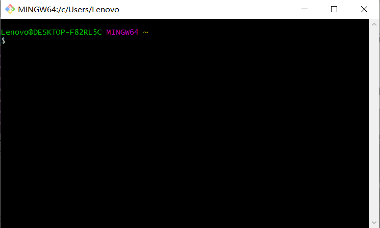

### Git的导入

Git仓库管理功能是GitHub的核心。因此，使用GitHub之前须掌握Git的相关知识，同时本地的设备还要安装Git环境。

## 诞生背景

Git属于分散型版本管理系统，是为版本管理而设计的软件。

Linux的创始人Linus Torvalds在2005年开发了Git的原型程序。当时由于在Linux内核开发中使用的既有版本管理系统的开发方许可证发生了变更，为了更换新的版本管理系统，Torvalds开发了Git。

Linux内核的更新速度在全世界也算首屈一指。因此，势必需要一个功能强、性能高的版本管理系统来提高开发速度。

## 什么是版本管理

版本管理就是管理更新的历史记录。它为我们提供了一些在软件开发过程中必不可少的功能，例如记录一款软件添加或更改源代码的过程，回滚到特定阶段，恢复误删除的文件等。

在Git出现以前，都普遍采用Subversion等集中型版本管理系统，而现在Git成了主流。由于GitHub的普及，想必使用Git的会越来越多。

下面来说一下提到的Subversion这类集中型与Git这种分散型的不同点。

- 集中型

  以Subversion为代表的集中型，如下图所示将仓库集中存放在服务器之中，所以只存在一个仓库。这就是为什么Subversion会被称为集中型。

  集中型将所有数据集中存放在服务器当中，有便于管理的优点。但是一旦开发者所处的环境不能连接服务器，就无法获取最新的源代码，开发也就几乎无法进行。

  

- 分散型

  下图是以Git为代表的分散型示意图。GitHub将仓库Fork给了每一个用户。Fork就是将GitHub的某个特定仓库复制到自己的账户下。Fork出的仓库与原仓库是两个不同的仓库，开发者可以随意编辑。

  

  分散型拥有多个仓库，相对而言稍显复杂。不够，由于本地的开发环境中就有仓库，所以不必连接远程仓库就可进行开发。

- 集中型与分散型哪个更好

  要说集中型与分散型哪个更好，其实双方都各有优缺点，需要看具体情况而定。不过，随着 Git 与 GitHub 的普及，今后使用分散型的开发者将会占绝大多数。

  只要脑中掌握了多个仓库并存的概念，学习分散型并不是什么难事。

## 安装

下载地址：http://msysgit.github.io/ 

在Windows环境中，最简单快捷的方法是使用 msysGit。按照Downloads向导下载安装包，只要双击运行，按照向导一步步安装即可。

- 组件的选择

  在下图的页面中选择需要的组件。由于所有必要组件都已默认勾选，可直接下一步。

  

- 设置环境变量

  在下图中，可以设置调用Git的环境变量。这里只会用到msysGit中附属的Git Bash命令提示符，所以请选择最上面的Use Git Bash only。

  

- 换行符的处理

  在下图中，选择换行符的相关设置。

  GitHub中公开的代码大部分是以Mac或Linux中的LF换行。由于Windows是以CRLF换行的，所以在非对应的编辑器中将不能正常显示。使用Windows环境的推荐按照下图所示选择。

  

- Git Bash

  安装好之后，Git Bash会作为一个应用程序添加进系统，双击启动后，会弹出一个名为Git Bash的命令提示符，类似下图，附属于msysGit。如果按照之前流程进行安装的话，那么git命令只能在Git Bash中使用。

  

## 初始设置

- 设置姓名和邮箱地址

  首先设置使用Git时的姓名和邮箱地址，名字用英文输入。

  ```shell
  git config --global user.name "san zhang"
  git config --global user.email "zhangsan@163.com"
  ```

  这个命令会在"~/.gitconfig"(如：`C:\Users\Lenovo\gitconfig`)中如以下形式输出设置问文件。

  ```
  [user]
  	name = san zhang
  	email = zhangsan@163.com"
  ```

  想更改这些信息，可直接编辑这个设置文件。这里设置的姓名和邮箱会用在Git的提交日志中。由于在GitHub上公开仓库时，这里的姓名和邮箱会随着提交日志一同被公开，请不要使用不便公开的隐私信息。

- 提高命令输出的可读性

  将color.ui设置为auto可让命令的输出拥有更高的可读性。

  ```shell
  git config --global color.ui auto
  ```