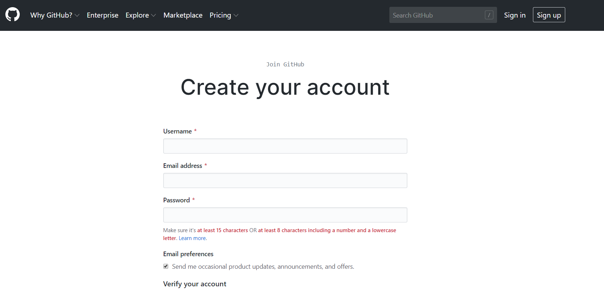
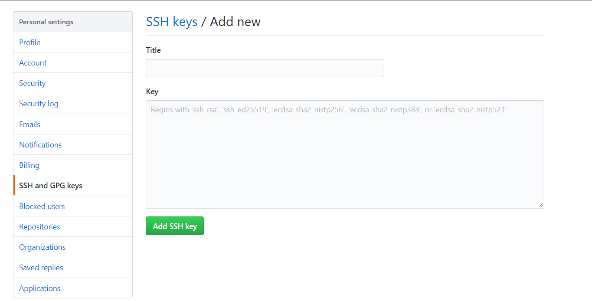
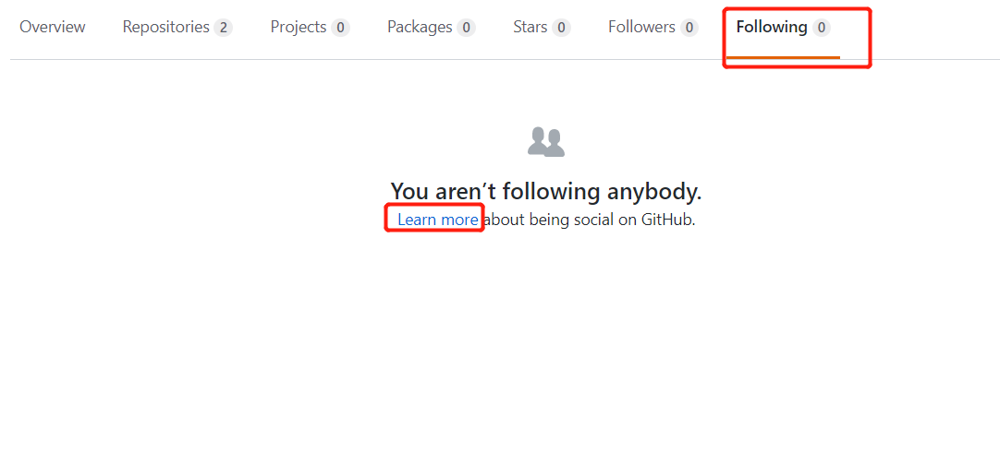
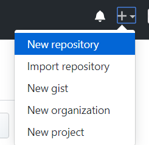
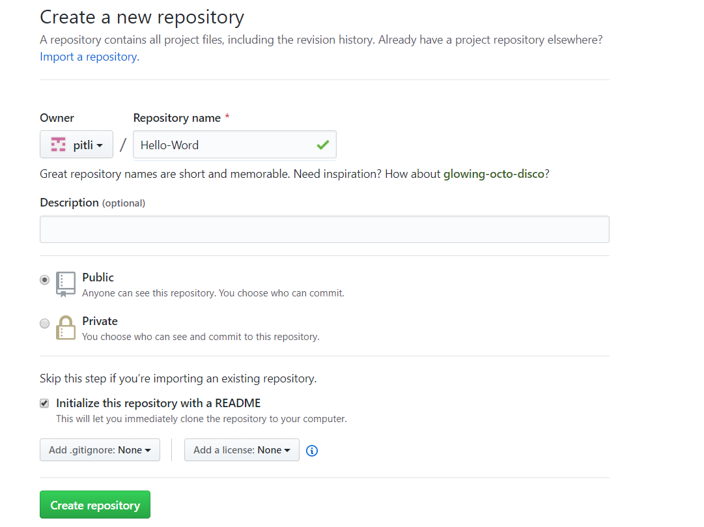
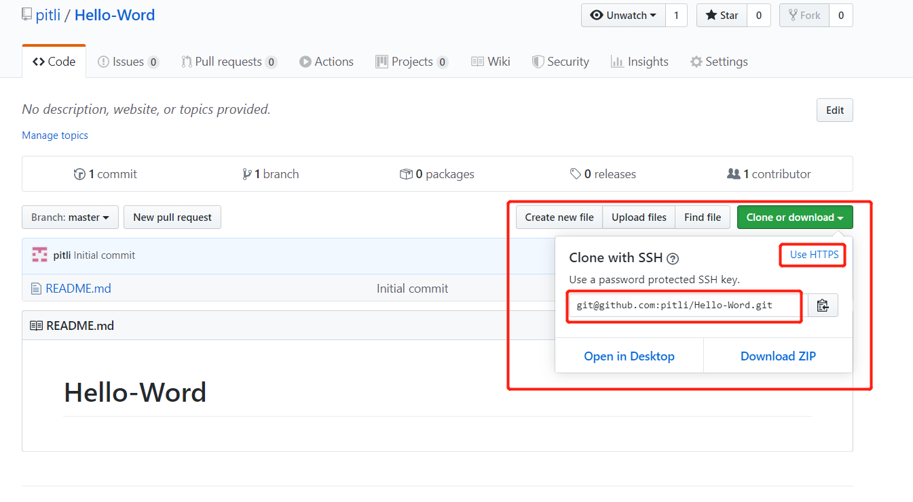
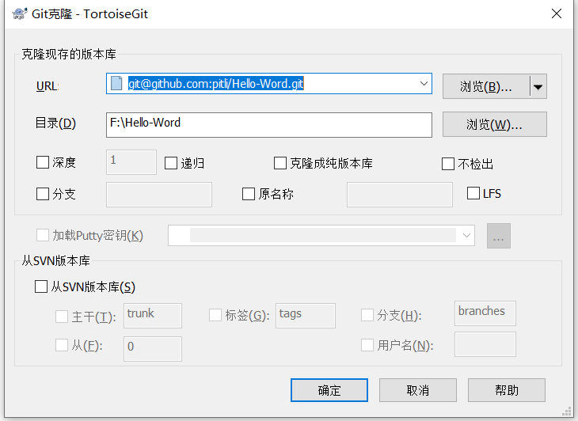
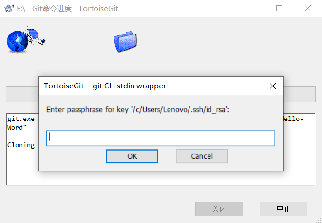

### 使用GitHub的前期准备


## 使用前的准备

- 创建账户

  首先创建GitHub账户，打开创建账户的页面。https://github.com/join

  在Username输入要创建的ID，公开页面的URL(http://github.com/Username)会用到这个ID。

  

  填写完后点击Create an account，完成账户的创建。创建完成后会进入登录状态，可开始使用GitHub。登录后的用户名会显示在右上方。

- 设置头像

  在GitHub上随处可见的头像(账户独有的标识)时通过Gravatar服务显示的。使用过WordPress可能对它有所了解。

  头像并不是使用GitHub时的硬性要求，但如果为代码配上编码者的相貌或标识，会让人觉得心安，同时还可能让对方对你产生兴趣。

- 设置 SSH Key

  GitHub上连接已有仓库时的认证，是通过使用SSH的公开秘钥认证方式进行的。现在来创建公开秘钥认证所需的SSH Key，并添加至GitHub。运行下面命令创建SSH Key：

  ```shell
  ssh-keygen -t rsa -C "your_email@example.com"
  Generating public/private rsa key pair.
  Enter file in which to save the key
  (/Users/your_user_directory/.ssh/id_rsa): 按回车键
  Enter passphrase (empty for no passphrase): 输入密码
  Enter same passphrase again: 再次输入密码
  ```

  "your_email@example.com"的部分请改成在创建账户时用的邮箱地址。密码需在认证时输入，请设置为复杂度高且容易记忆的组合。输入密码后出现以下结果：

  ```
  Your identification has been saved in /c/Users/Lenovo/.ssh/id_rsa.
  Your public key has been saved in /c/Users/Lenovo/.ssh/id_rsa.pub.
  The key fingerprint is:
  fingerprint值 your_email@example.com
  The key's randomart image is:
  ......
  ```

  fingerprint值是一串字符如：`4MvEvBjuVYLzimgIZJ56VSFEcUaa9tth3aaRSVJY333`，id_rsa文件时私有秘钥，id_rsa.pub时公开秘钥。

- 添加公开秘钥

  在GitHub添加公开秘钥，今后可用私有秘钥进行认证。

  点击右上角用户头像进入Settings，选择SSH and GPG keys。点击 New SSH Key，会看到下图的界面。在Title输入适当的秘钥名称。Key请粘贴id_rsa.pub文件的内容

  

  添加成功后，所用的邮箱会收到一封提示"公共秘钥添加完成"的邮件。

  完成以上设置后，可用手中的私人秘钥与GitHub进行认证和通信了。

  ```shell
  ssh -T git@github.com
  The authenticity of host 'github.com (207.97.227.239)' can't be established.
  RSA key fingerprint is `fingerprint值(之前生成秘钥时的一串字符串)`
  Are you sure you want to continue connecting (yes/no)? 输入yes
  ```

  出现以下结果即成功：

  ```
  Hi hirocastest! You've successfully authenticated, but GitHub does not
  provide shell access.
  ```

- 使用社区功能

  既然GitHub能够以人为焦点，那么在创建账户后不妨试试关注(Follow)别人。点击右上角头像点击Signed in as ...，进入个人界面，点击上面的Following，如果没有关注的人会显示下面的页面，点击Learn more会告诉你如何关注别人。

  

  这样一来，你所Follow的用户的活动会显示在你的控制面板页面中。可通过这种方式知道那个人在GitHub上都做了什么。对于仓库，也可使用Watch功能获取最新的开发信息。

## 实际动手使用

- 创建仓库

  实际创建一个公开的仓库，点击右上角加号选择New repository，创建新的仓库。

  

- New Repository

  - Repository name：输入仓库的名称。

  - Description：可以设置仓库的说明，这不是必填项，可留空。

  - Public、Private：Public为公开仓库，仓库内所有内容都会被公开。Private为非公开仓库，用户可设置访问权限，这项服务时收费的。

  - Initialize this repository with a README：打钩后，GitHub会自动初始化仓库并设置README文件，让用户可立刻clone这个仓库。如果向GitHub添加已有Git仓库，建议不要勾选，直接手动push。

  - Add .gitignore：通过它在初始化时自动生成.gitignore文件。这个设定会帮我们把不需要在Git仓库中进行版本管理的文件记录在.gitignore文件中，省去了每次根据框架进行设置的麻烦。

  - Add a license：选择要添加的许可协议文件。如果这个仓库中包含的代码已确定许可协议，那么请在这选择。随后将自动生成包含许可协议内容的LICENSE文件，用来表明该仓库内容的许可协议。

  输入选择都完成后，点击Create repository完成仓库的创建。

  

- 连接仓库

  https://github.com/用户名/Hello-World

  - README.md

    README.md在初始化时已经生成好了。README.md文件的内容会自动显示在仓库的首页当中。因此，一般会在这个文件中标明本仓库所包含的软件的概要、使用流程、许可协议等信息。如果使用Markdown语法进行描述，还可添加标记，提高可读性。

  - GitHub Flavored Markdown

    在GitHub上进行交流时用到的Issue、评论、Wiki，都可用Markdown语法表述，从而进行标记。准确说是GitHub Flavored Markdown语法。该语法是在Markdown基础上扩充而来，但一般只要按照原本的Markdown语法进行秒速即可。

    使用GitHub后，很多文档都需用Markdown来写。

    Markdown语法：http://www.ituring.com.cn/article/775 

- 公开代码

  - clone已有仓库

    接下来尝试在已有仓库中添加代码并加以公开。首先将已有仓库clone到身边的开发环境中。

    点击 Clone or download，使用SSH克隆，不要使用HTTPS克隆。复制仓库路径。

    

    使用以下命令进行克隆项目：

    ```shell
    $ git clone git@github.com:pitli/Hello-Word.git F:\Hello-Word
    Cloning into 'F:Hello-Word'...
    Enter passphrase for key '/c/Users/Lenovo/.ssh/id_rsa':
    remote: Enumerating objects: 3, done.
    remote: Counting objects: 100% (3/3), done.
    remote: Total 3 (delta 0), reused 0 (delta 0), pack-reused 0
    Receiving objects: 100% (3/3), done.
    ```

    Enter passphrase for key这里会要求输入GitHub上设置的公开秘钥的密码。认证成功后，仓库会被clone至仓库名后的目录中。将想要公开的代码提交至这个仓库再push到GitHub的仓库中，代码便会被公开。

    也可在一个文件夹下点击右键选择`Git克隆`，如下图：

    

    输入公开秘钥的密码，如下图：

    

  - 编写代码

    编写一个hello_word.php文件，用来输出 "Hello Word!"。

    ```php
    <?php
    	echo "Hello Word!";
    ?>
    ```

    由于hello_word.php还没有添加至Git仓库，所以显示为Untracked files

    ```shell
    $ git status
    On branch master
    Untracked files:
    (use "git add <file>..." to include in what will be committed)
    
    hello_world.php
    nothing added to commit but untracked files present (use "git add" to track)
    ```

  - 提交

    将hello_word.php提交至仓库。

    ```shell
    $ git add hello_word.php
    $ git commit -m "Add hello world script by php"
    [master d23b909] Add hello world script by php
    1 file changed, 3 insertions(+)
    create mode 100644 hello_world.php
    ```

    通过git add将文件加入暂存区，再通过git commit提交。

    通过git log查看提交日志。

    ```shell
    $ git log
    commit d23b909caad5d49a281480e6683ce3855087a5da
    Author: san zhang <zhangsan@163.com>
    Date: Tue May 1 14:36:58 2012 +0900
    ......
    ```

    > 公开时的许可协议：
    >
    > 即便在GitHub上公开了源代码，也不代表著作者放弃了著作权等权利。代码的权利持有人请选择合适的许可协议。在GitHub上，有修正 BSD 许可协议、Apache 许可协议等多种许可协议供人们选择，不过大多数软件都使用MIT许可协议。
    >
    > MIT许可协议实际使用时，只需将LICENSE文件加入仓库，并在README.md文件中声明使用了何种许可协议即可。使用没有声明许可协议的软件时，以防万一最好直接联系著作者。
    >
    > MIT详细内容：http://www.opensource.org/licenses/mit-license.php
    
  - 进行push
  
    只要执行push，GitHub上的仓库就会被更新。
  
    ```shell
    $ git push
    Enter passphrase for key '/c/Users/Lenovo/.ssh/id_rsa':`输入GitHub上设置的公开秘钥的密码`
    Enumerating objects: 4, done.
    Counting objects: 100% (4/4), done.
    Delta compression using up to 4 threads
    Compressing objects: 100% (2/2), done.
    Writing objects: 100% (3/3), 323 bytes | 161.00 KiB/s, done.
    Total 3 (delta 0), reused 0 (delta 0)
    To github.com:pitli/Hello-Word.git
       4e50010..463bcc7  master -> master
    ```
  
    这样一来代码就在GitHub上公开了。可用http://github.com/用户名/Hello-World查看一下。

