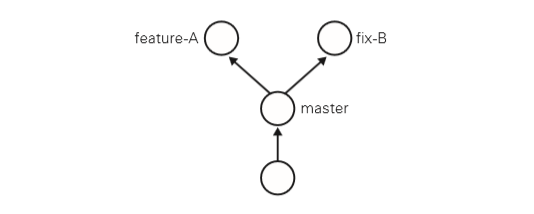
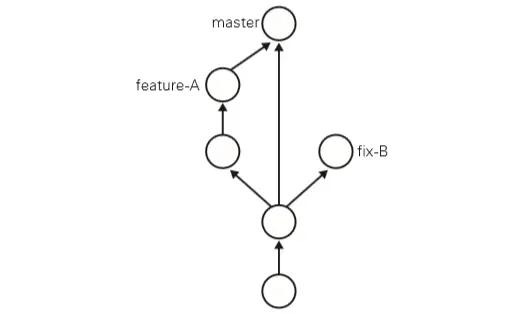
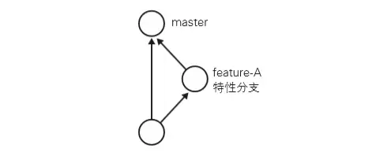
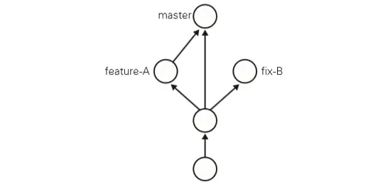
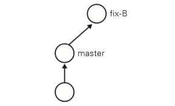
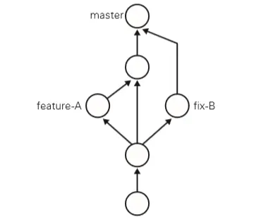
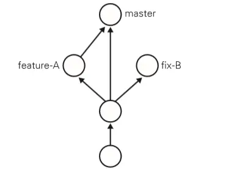

### 通过实际操作学习Git


## 基本操作

- git init：初始化仓库

  要使用Git进行版本管理，必须先初始化仓库。Git是使用git init命令进行初始化的。请实际建立一个目录并初始化仓库。

  ```shell
  $ mkdir git-tutorial
  $ cd git-tutorial
  $ git init
  Initialized empty Git repository in F:/vuetest/git-tutorial/.git/
  ```

  如果初始化成功，执行了git init命令的目录下就会生成.git目录。这个.git目录里存储着管理当前目录内容所需的仓库数据。

  在 Git 中，我们将这个目录的内容称为 "附属于该仓库的工作树"。文件的编辑等操作在工作树中进行，然后记录到仓库中，以此管理文件的历史快照。如果想将文件恢复到原先的状态，可以从仓库中调取之前的快照，在工作树中打开。开发者可以通过这种方式获取以往的文件。

- git status：查看仓库的状态

  git status名利用于显示Git仓库的状态。这是一个十分常用的命令。

  工作树和仓库在被操作的过程中，状态会不断发生变化。在Git操作过程中时常用git status命令查看当前状态，可谓基本中的基本。

  ```shell
  $ git status
  On branch master
  
  Initial commit
  
  nothing to commit (create/copy files and use "git add" to track)
  ```

  结果显示我们处于master分支下。关于分支会在后面提到。接着还显示没有可提交的内容。

  在这里新建README.md文件作为管理对象，为第一次提交做准备。

  ```shell
  $ touch README.md
  $ git status
  On branch master
  
  Initial commit
  Untracked files:# (use "git add <file>..." to include in what will
  be committed)
  README.md
  nothing added to commit but untracked files present (use "git add" to
  track)
  ```

  可以看到Untracked files中显示了README.md文件。类似地，只要对Git的工作树或仓库进行操作，git status命令的显示结果就会发生变化。

- git add：向暂存区中添加文件

  如果只是用 Git 仓库的工作树创建了文件，那么该文件并不会被记入Git仓库的版本管理对象当中。因此使用git status查看README.md时，会显示在Untracked files里。

  要想让文件成为Git仓库的管理对象，就要用到git add命令将其加入暂存区(Stage或Index)中。暂存区时提交前的一个临时区域。

  ```shell
  $ git add README.md
  $ git status
  On branch master
  
  Initial commit
  
  Changes to be committed:
  (use "git rm --cached <file>..." to unstage)
  
  new file: README.md
  ```

  将README.md文件加入暂存区后，git status命令的显示结果发生了变化。可以看到，README.md文件显示在Changes to be committed中了。

- git commit：保存仓库的历史记录

  git commit命令可以将当前暂存区中的文件实际保存到仓库的历史记录中。通过这些记录，就可在工作树中复原文件。

  - 记述一行提交信息

    实际运行以下git commit命令。

    ```shell
    $ git commit -m "First commit"
    [master (root-commit) 9f129ba] First commit
    1 file changed, 0 insertions(+), 0 deletions(-)
    create mode 100644 README.md
    ```

    -m参数后的 "First commit"称作提交信息，是对这个提交的概述。

  - 记述详细提交信息

    刚才只是简单的记述了一行提交信息，如想记述的更加详细，请不加 -m，直接执行git commit命令。执行后编辑器就会启动，并显示如下结果：

    ```shell
    Please enter the commit message for your changes. Lines starting
    with '#' will be ignored, and an empty message aborts the commit.
    On branch master
    
    Initial commit
    
    Changes to be committed:
    (use "git rm --cached <file>..." to unstage)
    
    new file: README.md
    
    ```

    在编辑器中记述提交信息格式如下：

    - 第一行：用一行文字简述提交的更改内容
    - 第二行：空行
    - 第三行以后：记述更改的原因和详细内容

    只要按照上面的格式输入，今后便可以通过确认日志的命令或工具看到这些记录。

    在Changes to be committed栏中，可以查看本次提交中包含的文件。

  - 中止提交

    如果在编辑器启动后想中止提交，请将提交信息留空并直接关闭编辑器，随后提交就会被中止。

  - 查看提交后的状态

    执行完git commit命令后再来查看当前状态。

    ```shell
    $ git status
    On branch master
    nothing to commit, working directory clean
    ```

    当前工作树处于刚刚完成提交的最新状态，所以结果显示没有更改。

- git log：查看提交日志

  git log命令可以查看以往仓库中提交的日志。包括可以查看什么人在什么时候进行了提交或合并，以及操作前后有怎样的差别。

  先查看git commit是否被记录了。

  ```
  $ git log
  commit f5a1e06612004b53abdb43a590f4f7717481dc1d (HEAD -> master)
  Author: san zhang <zhangsan@163.com>
  Date:   Sat Jan 18 15:26:14 2020 +0800
  
      First commit
  ```

  commit栏显示的 f5a1e...是指向这个提交的哈希值。Git的其他命令中，在指向提交时会用到这个哈希值。Author栏中显示我们给Git设置的用户名和邮箱地址。Date栏中显示提交执行的日期和时间。再往下就是该提交的提交信息。
  
  - 只显示提交信息的第一行
  
    如只想让程序显示第一行简述信息，可以在git log命令后加上 --pretty=short。这样一来能够更轻松地把握多个提交。
  
    ```shell
    $ git log --pretty=short
    commit 9f129bae19b2c82fb4e98cde5890e52a6c546922
    Author: san zhang <zhangsan@163.com>
    First commit
    ```
  
  - 只显示指定目录、文件的日志
  
    只要在git log命令后加上目录名，便会只显示该目录下的日志。如果加的是文件名，就会只显示与该文件相关的日志。
  
    ```shell
    $ git log README.md
    ```
  
  - 显示文件的改动
  
    如果想查看提交所带来的改动，可以加上 -p参数，文件的前后差别就会显示在提交信息之后。
  
    ```shell
    $ git log -p
    ```
  
    如，执行下面的命令，可只查看README,md文件的提交日志以及提交前后的差别。
  
    ```shell
    $ git log -p README.md
    ```
  
- git diff：查看更改前后的差别

  git diff命令可以查看工作树、暂存区、最新提交之间的差别。

  在README.md文件中写点东西

  ```
  # Git文档
  ```

  - 查看工作树和暂存区的差别

    执行git diff查看当前工作树与暂存区的差别。

    ```shell
    $ git diff
    diff --git a/README.md b/README.md
    index e69de29..cb5dc9f 100644
    --- a/README.md
    +++ b/README.md
    @@ -0,0 +1 @@
    +# Git文档
    ```

    由于尚未用git add命令想暂存区添加任何东西，所以程序只会显示工作树与最新提交状态之间的差别。

    用 "+"号标出的是新添加的行，被删除的行则用 "-"号标出。可看到这里只添加了一行。

    用git add命令将README.md文件加入暂存区。

    ```shell
    $ git add README.md
    ```

  - 查看工作树和最新提交的差别

    如现在执行 git diff，由于工作树和暂存区的状态并无差别，结果什么都不会显示。要查看与最新提交的差别，执行以下命令

    ```shell
    $ git diff HEAD
    diff --git a/README.md b/README.md
    index e69de29..cb5dc9f 100644
    --- a/README.md
    +++ b/README.md
    @@ -0,0 +1 @@
    +# Git教程
    ```

    一般在执行git commit命令之前先执行git diff HEAD命令，查看本次提交与上次提交之间有什么差别，等确认完毕后再进行提交。这里的HEAD是指向当前分支中最新一次提交的指针。

    由于之前确认过两个提交之间的差别，所以直接运行git commit命令。

    ```shell
    $ git commit -m "Add index"
    [master fd0cbf0] Add index
    1 file changed, 1 insertion(+)
    ```

    保险起见，执行git log查看一下提交日志，确认提交是否成功。

## 分支的操作

在进行多个并行作业时，会用到分支。在这类并行开发的过程中，往往同时存在多个最新代码状态。如下图，从master分支创建feature-A分支和fix-B分支后，每个分支都有自己最新代码。master分支是Git默认创建的分支，因此所有开发基本都是以这个分支为中心进行的。



不同分支中，可同时进行完全不同的作业。如下图，比如feature-A分支的作业结束后与master合并。通过灵活运用分支，可让多人同时高效进行并行开发。



- git branch：显示分支一览表

  git branch命令可将分支名列表显示，同时可确认当前所在分支。

  ```shell
  $ git branch
  * master
  ```

  在master左侧有"*"，表示这是当前所在分支，也就是在master分支下进行开发。结果中没有显示其他分支名，表示本地仓库只有master一个分支。

- git checkout -b：创建、切换分支

  - 切换到feature-A分支并进行提交

    创建feature-A分支：

    ```shell
    $ git checkout -b feature-A
    Switched to a new branch 'feature-A'
    ```

    连续执行下面两条命令也能收到同样效果。

    ```shell
    $ git branch feature-A
    $ git checkout feature-A
    ```

    切换为feature-A分支，这时再查看分支列表：

    ```shell
    $ git branch
    * feature-A
    master
    ```

    在feature-A左侧有"*"，当前分支为feature-A。在这个状态下开发，执行git add命令并进行提交的话，代码就会提交至feature-A分支。像这样不断对一个分支进行提交，称作"培育分支"。

    在README.md添加一行：

    ```
    # Git文档
    
    	- feature-A
    ```

    添加完后进行提交，这一行就添加到feature-A分支中了：

    ```shell
    $ git add README.md
    $ git commit -m "Add feature-A"
    [feature-A 8a6c8b9] Add feature-A
    1 file changed, 2 insertions(+)
    ```

  - 切换到master分支

    现在看一下master分支有没受影响，切换至master分支：

    ```shell
    $ git checkout master
    Switched to branch 'master'
    ```

    然后查看README.md文件，会发现并没有被添加文字。feature-A分支的更改不会影响到master分支，这是开发中创建分支的优点。只要创建多个分支，就可在不互相影响情况下同时进行多个功能开发。

  - 切换回上一个分支

    ```shell
    $ git checkout -
    Switched to branch 'feature-A'
    ```

    像这样用"-"代替分支名，可切换至上一个分支。将"-"换成feature-A也可以切换成feature-A分支。

- 特性分支

  Git与SVN等几种型版本管理系统不同，创建分支不需连接中央仓库，能相对轻松创建分支。因此当今大部分工作流程中都用到了特性分支。

  特性分支顾名思义，是集中实现单一特性，除此之外不进行任何作业的分支。日常开发中，往往创建数个特性分支，同时在此之外保留一个随时可以发布软件的稳定分支。稳定分支通常有master分支担当。

  

  之前创建的分支主要实现feature-A，除feature-A的实现之外不进行任何作业。即便开发中出现BUG，也需要再创建新的分支，在新分支中进行修改。

  基于特定主题的作业在特性分支中进行，主题完成后再与master分支合并。只要保持这样一个开发流程，就能保证master分支可随时供人查看。

- 主干分支

  主干分支时刚才的特性分支的原点，同时也是合并的终点。通常会用到master分支作为主干分支。

  有时需要让这个主干分支总是配置在正式环境中，有时又需要用标签Tag等创建版本信息，同时管理多个版本发布。拥有多个版本发布时，主干分支也有多个。

- git merge：合并分支

  假设feature-A已实现完毕，要将它合并到主干分支master中。先切换至master分支：

  ```shell
  $ git checkout master
  Switched to branch 'master'
  ```

  然后合并feature-A分支。为了历史记录中明确记录本次分支合并，需创建合并提交。在合并时加上 --no-ff参数：

  ```shell
  $ git merge --no-ff feature-A
  ```

  随后编辑器会启动，用于录入合并提交的信息：

  ```shell
  Merge branch 'feature-A'
  # Please enter a commit message to explain why this merge is necessary,
  # especially if it merges an updated upstream into a topic branch.
  #
  # Lines starting with '#' will be ignored, and an empty message aborts
  # the commit.
  ```

  默认信息中包含了是从feature-A分支合并过来的相关内容，不必做任何更改。可使用 `:wq!`保存并退出编辑器。然后看到下面的结果：

  ```shell
  Merge made by the 'recursive' strategy.
  README.md | 2 ++
  1 file changed, 2 insertions(+)
  ```

  feature-A的内容就合并到master中了。

- git log --graph：以图表形式查看分支

  用该命令进行查看，可清楚看到特性分支提交的内容已合并。特性分支的创建以及合并也都清楚明了：

  ```shell
  $ git log --graph
  *   commit 01637f61230fad49273e2210095c4a6d3b42e91c (HEAD -> master)
  |\  Merge: 6fc0ee0 d26187b
  | | Author: san zhang <zhangsan@163.com>
  | | Date:   Sun Jan 19 09:52:03 2020 +0800
  | |
  | |     Merge branch 'feature-A'
  | |
  | * commit d26187b8362c89f26eb5657e8bfd29aaca955baa (feature-A)
  |/  Author: san zhang <zhangsan@163.com>
  |   Date:   Sun Jan 19 09:32:49 2020 +0800
  |
  |       Add feature-A
  |
  * commit 6fc0ee04c3258095246923341a32605e3125de65
  | Author: san zhang <zhangsan@163.com>
  | Date:   Sat Jan 18 16:11:28 2020 +0800
  |
  |     Add index
  |
  * commit f5a1e06612004b53abdb43a590f4f7717481dc1d
    Author: san zhang <zhangsan@163.com>
    Date:   Sat Jan 18 15:26:14 2020 +0800
  ```
  

## 更改提交的操作

- git reset：回溯历史版本

  Git是可以灵活操作历史版本的。借助分散仓库的优势，可以在不影响其他仓库的前提下对历史版本进行操作。

  为了熟悉对历史版本的操作，先回溯历史版本，创建fix-B的特性分支。

  

  - 回溯到创建feature-A分支前

    先回溯到创建feature-A之前，创建fix-B的特性分支。

    要让仓库的HEAD、暂存区、当前工作数回溯到指定状态，需用到`git rest --hard`命令。只需提供目标时间点的哈希值，就可恢复至该时间点的状态。

    ```shell
    $ git reset --hard 6fc0ee04c3258095246923341a32605e3125de65
    HEAD is now at 6fc0ee0 Add index
    ```

    此时已成功回溯到feature-A创建之前。由于回溯到了指定哈希值对应的时间上，README.md的内容也恢复到了当时的状态。

  - 创建fix-B分支

    ```shell
    $ git checkout -b fix-B
    Switched to a new branch 'fix-B'
    ```

    在README.md文件添加一行：

    ```
    # Git教程
    
    	- fix-B
    ```

    提交README.md文件：

    ```shell
    $ git add README.md
    
    $ git commit -m "Fix B"
    [fix-B 4096d9e] Fix B
    1 file changed, 2 insertions(+)
    ```

    现在的状态如下图

    

    接下来的目标是下图所示的状态，即主干分支合并feature-A分支的修改后，又合并了fix-B的修改。

    

  - 推进至feature-A分支合并后的状态

    先恢复到feature-A合并后的状态，不妨称这一操作为"推进历史"。

    git log只能查看以当前状态为终点的历史日志。所以这里使用git reflog命令，查看当前仓库的操作日志。在日志中找出回溯历史之前的哈希值，通过git reset --hard命令恢复到回溯历史前的状态。

    执行git reflog：

    ```shell
    $ git reflog
    c466ae9 (HEAD -> fix-B) HEAD@{0}: commit: Fix B
    6fc0ee0 (master) HEAD@{1}: checkout: moving from master to fix-B
    6fc0ee0 (master) HEAD@{2}: reset: moving to 6fc0ee04c3258095246923341a32605e3125de65
    01637f6 HEAD@{3}: merge feature-A: Merge made by the 'recursive' strategy.
    6fc0ee0 (master) HEAD@{4}: checkout: moving from feature-A to master
    d26187b (feature-A) HEAD@{5}: checkout: moving from master to feature-A
    6fc0ee0 (master) HEAD@{6}: checkout: moving from feature-A to master
    d26187b (feature-A) HEAD@{7}: commit: Add feature-A
    6fc0ee0 (master) HEAD@{8}: checkout: moving from master to feature-A
    6fc0ee0 (master) HEAD@{9}: commit: Add index
    f5a1e06 HEAD@{10}: commit (initial): First commit
    ```

    在日志中，可看到commit、checkout、reset、merge等Git命令的执行记录。只要不进行Git的GC，就可通过日志随意调取近期的历史状态。即便开发者错误执行了Git操作，基本都可以利用git reflog命令恢复到原先的状态，所以本部分请牢记。

    上面第四行表示feature-A特性分支合并后的状态，对应哈希值01637f6。现在将HEAD、暂存区、工作树恢复到这个时间点的状态。

    ```shell
    $ git checkout master
    
    $ git reset --hard 01637f6
    HEAD is now at 01637f6 Merge branch 'feature-A'
    ```

    之前使用git reset --hard回溯了历史，这里通过它恢复到了回溯前的历史状态。当前状态如下图所示

    

- 消除冲突

  现在只要合并fix-B，就可得到我们想要的状态。

  ```shell
  $ git merge --no-ff fix-B
  Auto-merging README.md
  CONFLICT (content): Merge conflict in README.md
  Automatic merge failed; fix conflicts and then commit the result.
  ```

  这时，系统告诉我们文件出现冲突。在合并README.md文件时，feature-A更改的部分与本次要合并的fix-B更改的部分发生了冲突。

  - 查看冲突部分并将其解决

    用编辑器打开README.md文件，会发现变成了下面这样：

    ```
    # Git文档
    
    <<<<<<< HEAD
    	- feature-A
    =======
    	- fix-B
    >>>>>>> fix-B
    ```

    =======以上部分是HEAD的内容，以下是要合并fix-B的内容，在编辑器中改成想要的样子。

    ```
    # Git文档
    
    	- feature-A
    	- fix-B
    ```

    这次修正让feature-A和fix-B内容并存于文件之中。实际软件开发中，往往需删除其中之一，所以在处理冲突时，先要仔细分析冲突部分的内容后再进行修改。

  - 提交解决后的结果

    冲突解决后，执行git add和git commit。

    ```shell
    $ git add README.md
    
    $ git commit -m "Fix conflict"
    Recorded resolution for 'README.md'.
    [master 6a97e48] Fix conflict
    ```

- git commit --amend：修改提交信息

  将上一条提交信息记为了"Fix conflict"，但这其实是fix-B分支的合并，解决合并时发生的冲突只是过程之一，这样标记实在不妥。于是要修改这条信息。

  ```shell
  $ git commit --amend
  ```

  执行上面命令后，编辑器会启动。

  ```shell
  Fix conflict
  
  # Please enter the commit message for your changes. Lines starting
  # with '#' will be ignored, and an empty message aborts the commit.
  #
  # Date:      Sun Jan 19 10:43:45 2020 +0800
  #
  # On branch master
  # Changes to be committed:
  #       modified:   README.md
  #
  ```

  编辑器内容如上所示。请将提交信息的部分(也就是 Fix conflict)修改为Merge branch 'fix-B'，然后保存并退出。

  ```shell
  [master 8938bf6] Merge branch 'fix-B'
   Date: Sun Jan 19 10:43:45 2020 +0800
  ```

  保存退出后会显示上面这条结果。现在执行git log --graph，可看到提交日志相应内容也已修改。

  ```shell
  $ git log --graph
  *   commit 8938bf605060a9cf8b3d67efbfb1b8708abd3b9b (HEAD -> master)
  |\  Merge: 01637f6 c466ae9
  | | Author: san zhang <zhangsan@163.com>
  | | Date:   Sun Jan 19 10:43:45 2020 +0800
  | |
  | |     Merge branch 'fix-B'
  | |
  | * commit c466ae9b80d03a5a9289bca980b589733bf3b6c7 (fix-B)
  | | Author: san zhang <zhangsan@163.com>
  | | Date:   Sun Jan 19 10:22:32 2020 +0800
  | |
  | |     Fix B
  | |
  * |   commit 01637f61230fad49273e2210095c4a6d3b42e91c
  |\ \  Merge: 6fc0ee0 d26187b
  | |/  Author: san zhang <zhangsan@163.com>
  |/|   Date:   Sun Jan 19 09:52:03 2020 +0800
  | |
  | |       Merge branch 'feature-A'
  | |
  | * commit d26187b8362c89f26eb5657e8bfd29aaca955baa (feature-A)
  |/  Author: san zhang <zhangsan@163.com>
  |   Date:   Sun Jan 19 09:32:49 2020 +0800
  ```

- git rebase -i：压缩历史

  在合并特性分支前，如果发现已提交的内容有些许拼写错误等，不妨提交一个修改，然后将这个修改包含到前一个提交之中，压缩成一个历史记录。

  - 创建feature-C分支

    ```shell
    $ git checkout -b feature-C
    Switched to a new branch 'feature-C'
    ```

    在README.md添加一行，并故意拼写错误，以便之后修改。

    ```
    # Git文档
    
    	- feature-A
    	- fix-B
    	- faeture-C
    ```

    这个小变更没必要先执行git add再执行git commit，可用git commit -am一次完成两步操作。

    ```shell
    $ git commit -am "Add feature-C"
    [feature-C 83f3b14] Add feature-C
     1 file changed, 1 insertion(+)
    ```

  - 修正拼写错误

    请先自行修正README.md文件的内容，修正后如下所示：

    ```shell
    $ git diff
    diff --git a/README.md b/README.md
    index f567297..88e9eb5 100644
    --- a/README.md
    +++ b/README.md
    @@ -2,4 +2,4 @@
    
            - feature-A
            - fix-B
    -       - faeture-C
    +       - feature-C
    ```

    然后进行提交

    ```shell
    $ git commit -am "Fix typo"
    [feature-C ded8082] Fix typo
     1 file changed, 1 insertion(+), 1 deletion(-)
    ```

    实际上，我们不希望在历史记录中看到这类提交，因为健全的历史记录并不需要它们。如果能在最初提交之前就发现并修改，也就不会出现这类提交了。

  - 更改历史

    将"Fix typo"修正的内容与之前一次的提交合并，在历史记录中合并为一次提交。因此要用到git rebase。

    ```shell
    $ git rebase -i HEAD~2
    ```

    执行上面的命令，可选定单前分支中年包含HEAD在内的两个最新历史记录为对象，并在编辑器中打开。

    ```shell
    pick 83f3b14 Add feature-C
    pick ded8082 Fix typo
    
    # Rebase 8938bf6..ded8082 onto 8938bf6 (2 commands)
    #
    # Commands:
    # p, pick <commit> = use commit
    # r, reword <commit> = use commit, but edit the commit message
    # e, edit <commit> = use commit, but stop for amending
    # s, squash <commit> = use commit, but meld into previous commit
    # f, fixup <commit> = like "squash", but discard this commit's log message
    # x, exec <command> = run command (the rest of the line) using shell
    # b, break = stop here (continue rebase later with 'git rebase --continue')
    # d, drop <commit> = remove commit
    # l, label <label> = label current HEAD with a name
    # t, reset <label> = reset HEAD to a label
    # m, merge [-C <commit> | -c <commit>] <label> [# <oneline>]
    # .       create a merge commit using the original merge commit's
    # .       message (or the oneline, if no original merge commit was
    # .       specified). Use -c <commit> to reword the commit message.
    #
    # These lines can be re-ordered; they are executed from top to bottom.
    
    ```

    将ded8082的Fix typo压缩到83f3b14的Add feature-C里。将ded8082左侧的pick删除，改为fixup。

    ```
    pick 7a34294 Add feature-C
    fixup 6fba227 Fix typo
    ```

    ```shell
    [detached HEAD 51440c5] Add feature-C
    1 file changed, 1 insertion(+)
    Successfully rebased and updated refs/heads/feature-C.
    ```

    系统显示rebase成功，也就是两个提交改写成了一个新的提交。现在再查看提交日志时发现Add feature-C的哈希值已经改变。

  - 合并至master分支

    ```shell
    $ git checkout master
    Switched to branch 'master'
    
    $ git merge --no-ff feature-C
    Merge made by the 'recursive' strategy.
     README.md | 1 +
     1 file changed, 1 insertion(+)
    ```

## 推送至远程仓库

Git时分散型版本管理系统，之前所学的都是针对单一本地仓库的操作。远程顾名思义，是与我们本地仓库相对独立的另一个仓库。先在GitHub上创建一个仓库，并将其设为本地仓库的远程仓库。

按照之前创建仓库一样，创建一个名为git-tutorial的仓库。创建时不要勾选Initialize this repository with a README选项。勾选的话，GitHub会自动创建README文件，从创建之初便于本地失去了整合性。

- git remote add：添加远程仓库

  在GitHub上创建的仓库路径为 "git@github.com:用户名/git-tutorial.git"。现在用git remote add将其设置成本地仓库的远程仓库。

  ```shell
  $ git remote add origin git@github.com:pitli/git-tutorial.git
  ```

  Git会自动将git@github.com:pitli/git-tutorial.git远程仓库的名称设为origin(标识符)。

- git push：推送至远程仓库

  - 推送至master分支

    将本地仓库中的内容推送给远程仓库，要用到git push。

    ```shell
    $ git push -u origin master
    Enter passphrase for key '/c/Users/Lenovo/.ssh/id_rsa':`输入GitHub上设置的公开秘钥的密码`
    Enumerating objects: 20, done.
    Counting objects: 100% (20/20), done.
    Delta compression using up to 4 threads
    Compressing objects: 100% (8/8), done.
    Writing objects: 100% (20/20), 1.51 KiB | 258.00 KiB/s, done.
    Total 20 (delta 3), reused 0 (delta 0)
    remote: Resolving deltas: 100% (3/3), done.
    To github.com:pitli/git-tutorial.git
     * [new branch]      master -> master
    Branch 'master' set up to track remote branch 'master' from 'origin'.
    ```

    执行git push命令，当前分支的内容会被推送给远程仓库origin的master分支。-u参数可在推送的同时，将origin仓库的master分支设置为本地仓库当前分支的upstream(上游)。添加这个参数，将来运行git pull从远程仓库获取内容时，本地仓库的这个分支可直接从origin的master获取内容，省去另外添加参数的麻烦。

    在GitHub上可确认远程master的内容和本地master相同。

  - 推送master以外的分支

    除了master分支外，远程仓库也可创建其他分支。

    ```shell
    $ git checkout -b feature-D
    Switched to a new branch 'feature-D'
    ```

    在本地创建了feature-D分支，现在将它push给远程仓库。

    ```shell
    $ git push -u origin feature-D
    Total 0 (delta 0), reused 0 (delta 0)
    To git@github.com:github-book/git-tutorial.git
    * [new branch] feature-D -> feature-D
    Branch feature-D set up to track remote branch feature-D from origin.
    ```

## 从远程仓库获取

- git clone：获取远程仓库

  - 获取远程仓库

    先换到其他目录下，将GitHub上的仓库clone到本地。不要与之前操作的仓库在同一目录下。

    ```shell
    $ git clone git@github.com:pitli/git-tutorial.git
    Cloning into 'git-tutorial'...
    Enter passphrase for key '/c/Users/Lenovo/.ssh/id_rsa':
    remote: Enumerating objects: 20, done.
    remote: Counting objects: 100% (20/20), done.
    remote: Compressing objects: 100% (5/5), done.
    remote: Total 20 (delta 3), reused 20 (delta 3), pack-reused 0
    Receiving objects: 100% (20/20), done.
    Resolving deltas: 100% (3/3), done.
    ```

    执行git clone后默认处于master分支下，同时会自动将origin设为该远程仓库的标识符。本地的master与GitHub上的master内容上是完全相同的。

    ```shell
    $ git branch -a
    * master
      remotes/origin/HEAD -> origin/master
      remotes/origin/feature-D
      remotes/origin/master
    ```

    用git branch查看当前分支相关信息。添加-a参数可同时显示本地与远程仓库的分支信息。

  - 获取远程的feature-D分支

    ```shell
    $ git checkout -b feature-D origin/feature-D
    Switched to a new branch 'feature-D'
    Branch 'feature-D' set up to track remote branch 'feature-D' from 'origin'.
    ```

    -b参数后是本地新建分支的名称。新建分支名称后面是获取来源的分支名称。

  - 向本地的feature-D分支提交更改

    现在假定我们是另一个开发者，在README.md添加一行文字，查看更改。
    
    ```shell
    $ git diff
    diff --git a/README.md b/README.md
    index 88e9eb5..d5f5a51 100644
    --- a/README.md
    +++ b/README.md
    @@ -3,3 +3,4 @@
            - feature-A
            - fix-B
            - feature-C
    +       - feature-D
    ```
    
    提交更改
    
    ```shell
    $ git commit -am "Add feature-D"
    [feature-D 52cad85] Add feature-D
     1 file changed, 1 insertion(+)
    ```
    
  - 推送feature-D分支
  
    ```shell
    $ git push
    Enter passphrase for key '/c/Users/Lenovo/.ssh/id_rsa':
    Enumerating objects: 5, done.
    Counting objects: 100% (5/5), done.
    Delta compression using up to 4 threads
    Compressing objects: 100% (2/2), done.
    Writing objects: 100% (3/3), 281 bytes | 281.00 KiB/s, done.
    Total 3 (delta 0), reused 0 (delta 0)
    To github.com:pitli/git-tutorial.git
       76bfec3..52cad85  feature-D -> feature-D
    ```
  
- git pull：获取最新的远程仓库分支

  现在回到原先的那个目录下，这里的本地仓库值创建了feature-D分支，并没有在该分支中进行任何提交。然而远程仓库的feature-D中已有了我们刚刚推送的提交。这时使用git pull，将本地的feature-D更新到最新状态。

  ```shell
  $ git pull origin feature-D
  Enter passphrase for key '/c/Users/Lenovo/.ssh/id_rsa':
  remote: Enumerating objects: 5, done.
  remote: Counting objects: 100% (5/5), done.
  remote: Compressing objects: 100% (2/2), done.
  remote: Total 3 (delta 0), reused 3 (delta 0), pack-reused 0
  Unpacking objects: 100% (3/3), done.
  From github.com:pitli/git-tutorial
   * branch            feature-D  -> FETCH_HEAD
     76bfec3..52cad85  feature-D  -> origin/feature-D
  Updating 76bfec3..52cad85
  Fast-forward
   README.md | 1 +
   1 file changed, 1 insertion(+)
  ```

  远程仓库的feature-D分支是最新状态，所以本地仓库的feature-D就得到了更新。以后只需这样在本地进行提交再push给远程仓库，就可与其他开发者同时在同一分支进行作业，不断添加新功能。

  为减少冲突情况的发生，建议更频繁地进行push和pull操作。

## 帮助深入理解Git的资料

在实际开发过程中，可能用到更高级的Git操作，这里推荐一些资料。

- Pro Git

  Pro Git由就职于GitHub公司的Scott Chacon执笔，是一部零基础Git学习资料。基于知识共享的CC BY-NC-SA 3.0许可协议。

  http://git-scm.com/book/zh/v1

  https://github.com/schacon

- LearnGitBranching

  LearnGitBranching是学习Git基本操作的网站，注重树形结果的学习方式适合初学Git人员使用。

  http://pcottle.github.io/learnGitBranching/

- tryGit

  通过tryGit可在Web上以便操作一边学习Git的基本功能。只有英文版。

  http://try.github.io/