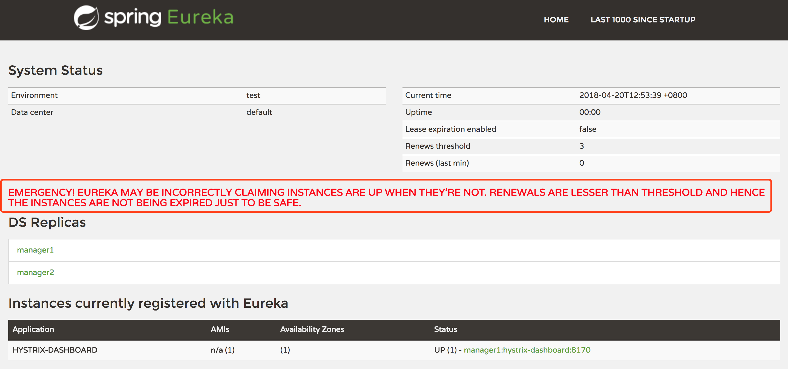

### 微服务注册与发现


## 服务发现简介

在微服务架构中，服务发现组件是一个非常关键的组件。服务提供者、服务消费者、服务发现组件者三者之间的关系大致如下：

- 各个微服务启动时，将自己的网络地址等信息注册到服务发现组件中，服务发现组件会存储这些信息
- 服务消费者可从服务发现组件查询服务提供者的网络地址，并使用该地址调用服务提供者的接口
- 各个微服务与服务发现组件使用一定机制（例如心跳）通信。服务发现组件如长时间无法与某微服务实例通信，就会注销该实例
- 微服务网络地址发生变更时，会重新注册到服务发现组件。使用这种方式，服务消费者就无需人工修改提供者的网络地址了

综上，服务发现组件应具备以下功能：

- 服务注册表：是服务发现组件的核心，用来记录各个微服务的信息，例如微服务的名称、IP端口等
- 服务注册于发现：服务注册指在微服务启动时，将自己的信息注册到服务发现组件上的过程。服务发现指查询可用微服务列表及其网络地址的机制
- 服务检查：服务发现组件使用一定机制定时检测已注册的服务，如发现某实例长时间无法访问，就会从服务注册表中移除该实例

## Eureka简介

Eureka时Netflix开源的服务发现组件，本身是一个基于REST的服务。它包含Server和Client两部分。Spring Cloud将它集成在子项目Spring Cloud Netflix中，从而实现微服务的注册和发现。

> **备注：**Eureka的GitHub：[http://github.com/Netflix/Eureka](http://github.com/Netflix/Eureka)

Eureka架构图：


Eureka包含两个组件：Eureka Server和Eureka Client，作用如下：

- Eureka Server提供服务发现能力，各个微服务启动时，会向Eureka Server注册自己的信息，Eureka Server会存储这些信息
- Eureka Client是一个Java客户端，用于简化与Eureka Server的交互
- 微服务启动后，会周期性（默认30秒）地向Eureka Server发送心跳以续约自己的“租期”
- 如果Eureka Server在一定时间没有接收到某个微服务实例的心跳，Eureka Server将会注销该实例（默认90秒）
- 默认情况下，Eureka Server同时也是Eureka Client。多个Eureka Server实例，互相之间通过复制的方式，来实现服务注册表中数据的同步
- Eureka Client会缓存服务注册表中的信息。这种方式有一定优势——首先，微服务无须每次请求都查询Eureka Server，从而降低了Eureka Server的压力；其次，即使Eureka Server所有节点都宕掉，服务消费者依然可以使用缓存中的信息找到服务提供者并完成调用

综上，Eureka通过心跳检查、客户端缓存机制，提高了系统的灵活性、可升缩性和可用性。

## 编写Eureka Server

创建一个Maven工程，ArtifactId是microservice-discovery-eureka：

```xml
<dependency>
	<groupId>org.springframework.cloud</groupId>
	<artifactId>spring-cloud-starter-eureka-server</artifactId>
</dependency>
```

编写启动类，在启动类上添加@EnableEurekaServer注解，声明这是一个Eureka Server：

```java
@SpringBootApplication
@EnableEurekaServer
public class EurekaApplication {

	public static void main(String[] args) {
		SpringApplication.run(EurekaApplication.class, args);
	}
}
```

在配置文件application.yml中添加以下内容：

```yml
server:
  port: 8761
eureka:
  client:
    register-with-eureka: false
    fetch-registry: false
    service-url:
      defaultZone: http://localhost:8761/eureka
```

- eureka.client.register-with-eureka：表示是否将自己注册到Eureka Server，默认为true。由于当前应用就是Eureka Server，故而设为false
- eureka.client.fetch-registry：表示是否从Eureka Server获取注册信息，默认为true。因为这是一个单点的Eureka Server，不需要同步其他的Eureka Server节点的数据，故而设为false
- eureka.client.service-url.defaultZone：设置Eureka Server交互的地址，查询服务和注册服务都需依赖这个地址。默认是http://localhost:8761/eureka；多个地址可用','分割

## 将微服务注册到Eureka Server

在服务提供者项目microservice-provider-user中添加：

```xml
<dependency>
	<groupId>org.springframework.cloud</groupId>
	<artifactId>spring-cloud-starter-eureka</artifactId>
</dependency>
```

在配置文件application添加以下配置：

```yml
spring:
  application:
    name: microservice-provider-user
eureka:
  client:
    service-url:
      dafaultZone: http://localhost:8761/eureka/
  instance:
    prefer-ip-address: true
```

- spring.application.name：用于指定注册到Eureka Server上的应用名称
- eureka.client.instance.prefer-ip-address：为true时表示将自己的IP注册到Eureka Server。如不配置该属性或将其设置为false，则表示注册微服务所在操作系统的hostname到Eureka Server

编写启动类，在启动类上添加@EnableDiscoveryClient注解，声明这是一个Eureka CLient：

```java
@SpringBootApplication
@EnableDiscoveryClient
public class ProvideruserApplication {
	
	public static void main(String[] args) {
		SpringApplication.run(ProvideruserApplication.class, args);
	}

}
```

也可使用@EnableEurekaClient注解替代@EnableDiscoveryClient。在Spring Cloud中，服务发现组件有多种选择，例如Zookeeper、Consul等。@EnableDiscoveryClient为各种服务组件提供了支持，该注解是spirng-cloud-commons项目的注解，是一个高度抽象；而@EnableEurekaClient表明时Eureka的Client，该注解是spring-cloud-netflix项目中的注解，只能与Eureka一起工作。当Eureka在项目的classpath中时，两个注解没有区别。

这样就可以将微服务注册到Eureka Server上了。服务消费者的配置修改参考提供者即可。

启动eureka服务和提供者服务以及消费者服务，访问http://localhost:8761/可查看eureka的信息页面。可以看到eureka 的微服务列表已经存在提供者和消费者

## Eureka Server的高可用

Eureka Server发生宕机，也不会影响到服务之间的调用。但如果Server宕机时，某些微服务也出现不可用的情况，Client中的缓存若不被更新，就可能会影响到微服务的调用，甚至影响到整个应用系统的高可用性。因此，在生产环境中，通常会部署一个高可用的Server集群。

Eureka Server可以通过运行多个实例并相互注册的方式实现高可用部署，Server实例会彼此增量的同步信息，从而确保所有节点数据一致。事实上，节点之间相互注册是Server的默认行为，可以回看 "编写Eureka Server"中的配置文件有两个属性配置了false

在之前Eureka Server的基础上修改：

配置系统的hosts，Windows系统的hosts文件路径是C:\Windows\System32\drivers\etc\hosts；Linux及Mac OS等系统的文件路径是/etc/hosts

```txt
127.0.0.1 peer1 peer2
```

将application.yml修改如下：让两个节点的Eureka Server相互注册

```yml
spring:
  application:
    name: microservice-discovery-eureka
---
spring:
  #指定profiles=peer1
  profiles: peer1
server:
  port: 8761
eureka:
  instance:
    #指定当profiles=peer1时，主机名时peer1
    hostname: peer1
  client:
    service-url:
      #将自己注册到peer2这个Eureka上面去
      dafaultZone: http://peer2:8762/eureka/
---
spring:
  profiles: peer2
server:
  port: 8762
eureka:
  instance:
    hostname:  peer2
  client:
    service-url:
      dafaultZone: http://peer1:8761/eureka/
```

使用（---）将该application.yml文件分为三段。第二段和第三段分别为spring.properties指定了一个值，该值表示它所在的那段内容应用在哪个Profile里。第一段由于没有指定spring.profiles，因此这段内容会对所有Profile生效。

当应用以peer1这个Profile启动时，配置该Eureka Server的主机名为peer1，并将其注册到http://peer2:8762/eureka/；反之，当应用以profile=peer2时，Eureka Server会注册到peer1节点的Eureka Server。

打包项目，并使用以下命令启动两个Eureka Server节点：

```
java -jar microservice-dicsovery-eureka-0.0.1-SNAPSHOT.jar --spring.profiles.active=peer1
java -jar microservice-dicsovery-eureka-0.0.1-SNAPSHOT.jar --spring.profiles.active=peer2
```

通过spring.profiles.active指定使用哪个profile启动。

将应用注册到Eureka Server集群上，只需修改eureka.client.service-url.defaultZone，配置多个Eureka Server地址，就可将其注册到Eureka Server集群：

```yml
eureka:
  client:
    service-url:
      dafaultZone: http://peer1:8761/eureka/,http://peer2:8762/eureka/
```

当然，微服务即使只配置Eureka Server集群中的某个节点，也能正常注册到Eureka Server集群，因为多个Eureka Server之间的数据会相互同步。不过为适应某些极端场景，建议在客户端配置多个Eureka Server节点。

## Eureka的自我保护模式

进入自我保护模式最直观的体现，时Eureka Server首页出现的警告



默认情况下，如果Eureka Server在一定时间没有接到服务实例的心跳，Server将会注销该实例。但是当网络分区故障发生时，微服务于Server之间无法通信，以上行为可能变得非常危险了，因为服务本身其实是健康的，此时本不应该注销该微服务。

Eureka通过“自我保护模式”来解决这个问题，当Eureka Server节点在短时间内丢失过多客户端时，那么这个节点会进入自我保护模式。一旦进入该模式，Eureka Server会保护服务注册表中的信息，不再删除服务组成表中的数据（也就是不会注销任何微服务）。当故障恢复后，该Eureka Server节点会自动退出自我保护模式。

综上，自我保护是一种应对网络异常的安全保护措施。它的架构哲学时宁可同时保留所有微服务，也不盲目注销任何健康的微服务。使用自我保护模式，可以让Eureka集群更加的健壮、稳定。

也可以使用eureka.server.enable-self-preservation = false禁用自我保护模式。

## 多网卡环境下的IP选择

对于多网卡的服务器，各个微服务注册到Eureka Server上的IP要如何指定呢？

例如某台服务器有eth0、eth1、eth2三块网卡，但是只有eth1可以被其他服务器访问；如果Eureka Client将eth0或者eth2注册到Eureka Server上，其他微服务就无法通过这个IP调用该微服务的接口。

Spring Cloud提供了按需选择IP的能力，从而避免上述问题：

忽略指定名称的网卡：

```yml
spring:
  cloud:
    inetutils:
      ignored-interfaces:
        - docker0
        - veth.*
```

这样就可以忽略docker0网卡以及所有以veth开头的网卡。

使用正则表达式，指定使用的网络地址：

```yml
spring:
  cloud:
    inetutils:
      perferredNetworks:
        - 192.168
        - 10.0
```

只使用站点本地地址：

```yml
spring:
  cloud:
    inetutils:
      use0nlySiteLocalInterfaces: true
```

这样就可强制使用站点本地地址。

手动指定IP地址：

```yml
eureka:
  instance:
    prefer-ip-address: true
    ip-address: 127.0.0.1
```

配置Eureka的健康检查：

```yml
eureka:
  client:
    healthcheck:
      enabled: true
```

启用Eureka的健康检查后，应用程序就会将自己的健康状态传播到Eureka Server。某些场景下，可能希望更细粒度地控制健康检查，此时可实现 com.netflix.appinfo.Health-CheckHandler接口。

> **注意：**eureka.client.healthcheck.enabled=true只能配置在application.yml中，如果配置在bootstarp.yml中，可能导致一些不良的副作用。例如应用注册后状态为UNKNOWN。