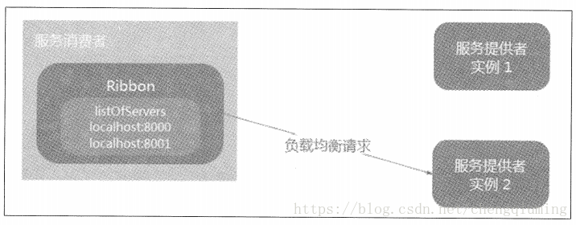

### Ribbon实现客户端侧负载均衡


## Riboon简介

Ribbon是Netflix发布的负载均衡器，它有助于控制HTTP和TCP客户端的行为。为Ribbon配置服务提供者地址列表后，Ribbon就可基于某种负载均衡算法，自动地帮助服务消费者去请求。Ribbon默认为我们提供了很多的负载均衡算法，例如轮询、随机等。当然，我们也可为Ribbon实现自定义的负载均衡算法。

在Spring Cloud中，当Ribbon与Eureka配合使用时，Ribbon可自动从Eureka Server获取服务提供者地址列表，并基于负载均衡算法，请求其中一个服务提供者实例。

> Ribbon的GitHub：[https://github.com/Netflix/ribbon](https://github.com/Netflix/ribbon)

Eureka与Ribbon配合使用架构图


## 为服务消费者整合Ribbon

复制项目microservice-consumer-movie，ArtifactId是microservice-consumer-movie-ribbon。

为项目引入Ribbon的依赖：

```xml
<dependency>
	<groupId>org.springframework.cloud</groupId>
	<artifactId>spring-cloud-starter-ribbon</artifactId>
</dependency>
```

如果项目已引入spring-cloud-starter-eureka依赖，因该依赖已经包含了spring-cloud-starter-ribbon，所以无需再次引入。

为RestTemplate添加@LoadBalanced注解，使RestTemplate整合Ribbon，使其具备负载均衡的能力：

```java
@Bean
@LoadBalanced
public RestTemplate restTemplate(){
    return new RestTemplate();
}
```

编写Controller：

```java
@RestController
public class MovieController{
    private static final Logger LOGGER = LoggerFactory.getLogger(MovieController.class);
    
    @Autowired
    private RestTemplate restTemplate;
    @Autowired
    private LoadBalancerClient loadBalancerClient;
    
    @GetMapping("/user/{id}")
    public User findById(@PathVariable Long id) {
    	return this.restTemplate.getForObject("http://microservice-provider-user/"+id, User.class);
    }
    
    @GetMapping("/log-instance")
    public void logUserInstance(){
        ServiceInstance serviceInstance = this.loadBalancerClient.choose("microservice-provider-user");
        //打印当前选择的时哪个节点
        MovieController.LOGGER.info("{}:{}:{}", serviceInstance.getServiceId(), serviceInstance.getHost(), serviceInstance.getPort());
    }
}
```

由代码可知，将请求的地址改成了http://microservice-provider-user/。microservice-provider-user时用户微服务的虚拟主机名，当Ribbon和Eureka配合使用时，会自动将虚拟主机名映射成微服务的网络地址。在新增的logUserInstance()方法中可使用LoadBalancerClient的API更加直观地获取当前选择的用户微服务节点。

> **备注：**虚拟主机名与虚拟IP非常类似，如果无法理解虚拟主机名，可将其简单理解成为提供者的服务名称，因为在默认情况下，虚拟主机名和服务名称是一致的。
>
> 不能将restTemplate.getForObject(...)与loadBalancerClient.choose(...)写在同一方法中，两者之间会有冲突，因为此时代码中的restTemplate实际上是一个Ribbon客户端，本身已经包含了“choose”的行为。
>
> 虚拟主机名不能包含“_”之类的字符，否则Ribbon在调用时会异常。

启动Eureka服务。通过修改端口，启动多个provider-user服务。启动ribbon服务。

多次访问http://localhost:8010，查看provider-user服务的控制台会打印Hibernate开头的日志。

多次访问http://localhost:8010/log-instance，查看ribbon服务的控制台日志，会发现访问端口一直在变。

## 使用Java代码自定义Ribbon配置

很多场景下，可能根据需求自定义Ribbon配置，例如修改Ribbon的负载均衡规则等。Spring Cloud Camden允许使用Java代码或属性自定义Ribbon的配置，两种方式等价。

在Spring Cloud中，Ribbon的默认配置如下（BeanType beanName：ClassName）：

- IclientConfig ribbonClientConfig：DefaulClientConfigImpl
- IRule ribbonRule：ZoneAvoidanceRule
- IPing ribbonPing：NoOpPing
- ServerList ribbonServerList：ConfigurationBasedServerList
- ServerListFilter ribbonServerListFilter：ZonePreferenceServerListFilter
- ILoadBalancer ribbonLoadBalancer：ZoneAwareLoadBalancer

示例代码如下：

```java
@Bean
@ConditionalOnMissingBean
public IRule ribbonRule(IClientConfig config){
    ZoneAvoidanceRule rule = new ZoneAvoidanceRule();
    rule.initWithNiwsConfig(config);
    return rule;
}
//来自org.springframework.cloud.netflix.ribbon.RibbonClientConfiguration
```

BeanType是IRule，beanName是ribbonRule，ClassName是ZoneAvoidanceRule，这是一种根据服务提供者所在Zone的性能以及服务提供者可用性综合计算，选择提供者节点的负载均衡规则。

在Spring Cloud中，Ribbon默认的配置类时RibbonClientConfiguration。也可使用一个POJO自定义Ribbon的配置。这种配置时细粒度的，不同的Ribbon客户端可以使用不同的配置。

复制项目microservice-consumer-movie-ribbon，ArtifactId是microservice-consumer-movie-ribbon-customizing

创建Ribbon配置类：

```java
/**
*该类为Ribbon的配置类
*注意：该类不应该在主应用程序上下文的@ComponentScan中
*/
@Configuration
public class RibbonConfiguration{
    @Bean
    public IRule ribbonRule(){
        //负载均衡规则，改为随机
        return new RandomRule();
    }
}
```

```java
/**
*使用RibbonClient，为特定name的Ribbon Client自定义配置
*使用@RibbonClient的configuration属性，指定Ribbon的配置类
*/
@Configuration
@RibbonClient(name = "microservice-provider-user", configuration = RibbonConfiguration.class)
public class TestConfiguration{
}
//使用@RibbonClient注解的Configuration属性，即可自定义指定名称Ribbon客户端的配置。
```

## 使用属性自定义Ribbon配置

从Spring Cloud Netflix1.2.0开始，Ribbon支持使用属性自定义Ribbon客户端。这种方式比使用Java代码配置的方式更加方便。

支持的属性如下，配置的前缀时<clientName>.ribbon.

- NFLoadBalancerClassName：配置ILoadBalancer的实现类
- NFLoadBalancerRuleClassName：配置IRule的实现类
- NFLoadBalancerPingClassName：配置IPing的实现类
- NIWSServerListClassName：配置ServerList的实现类
- NIWSServerListFilterClassName：配置ServerListFilter的实现类

复制项目microservice-consumer-movie-ribbon，ArtifactId是microservice-consumer-movie-ribbon-customizing-properties。在application.yml中添加一下内容：

```yml
microservice-provider-user:
  ribbon:
    NFLoadBalancerRuleClassName: com.netflix.loadbalancer.RandomRule
```

这样就能将负载均衡规则改为随机，不难看出，使用属性自定义的方式比用Java代码配置方便很多。

## 脱离Eureka使用Ribbon

前面的例子中，是将Ribbon与Eureka配合使用的。但现实中可能不具备这样的条件，例如一些遗留的微服务，它们可能并没有注册到Eureka Server上，甚至根本不是使用Spring Cloud开发的，此时要想使用Ribbon实现负载均衡，可直接分离Eureka进行使用，Ribbon支持脱离Eureka使用。

脱离Eureka使用Ribbon架构图



复制项目microservice-consumer-movie-ribbon，ArtifactId是microservice-consumer-movie-without-eureka

将pom.xml中的eureka依赖修改为ribbon依赖：

```xml
<dependency>
	<groupId>org.springframework.cloud</groupId>
	<artifactId>spring-cloud-starter-eureka</artifactId>
</dependency>
改为
<dependency>
	<groupId>org.springframework.cloud</groupId>
	<artifactId>spring-cloud-starter-ribbon</artifactId>
</dependency>
```

去掉启动类上的@EnableDiscoveryClient注解。

将application.yml改成如下：

```yml
server:
  port: 8010
spring:
  application:
    name: microservice-consumer-movie
microservice-provider-user:
  ribbon:
    listOfServers: localhost:8000,localhost:8001
```

其中，属性microservice-provider-user.ribbon.listOfServers用于为名为microservice-provider-user的Ribbon客户端设置请求的地址列表。

此时启动多个microservice-simple-provider-user实例，启动microservice-consumer-movie-without-eureka，尽管此时没有注册到Eureka上，Ribbon仍可正常工作，请求依旧会分摊到两个用户微服务节点上。