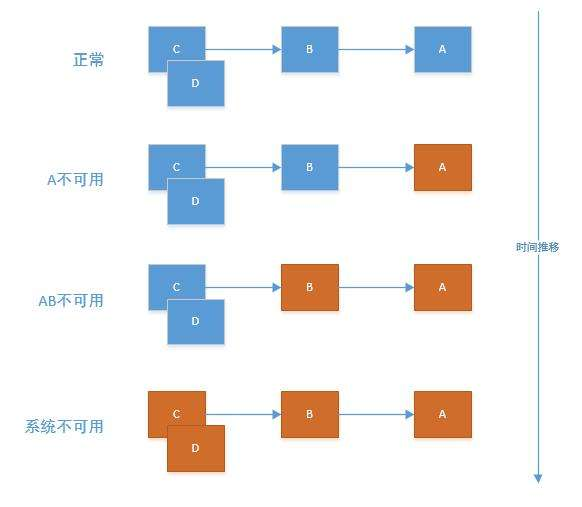
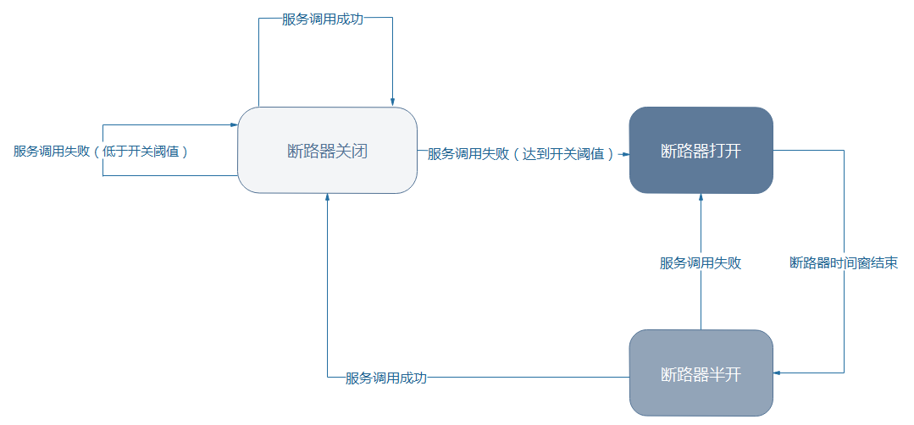
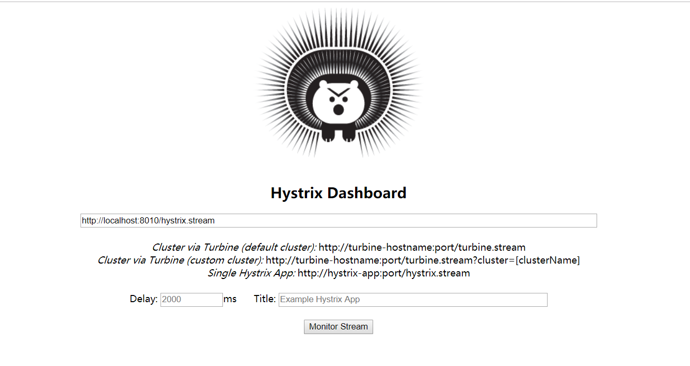
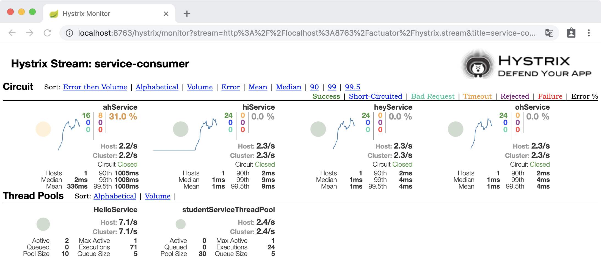
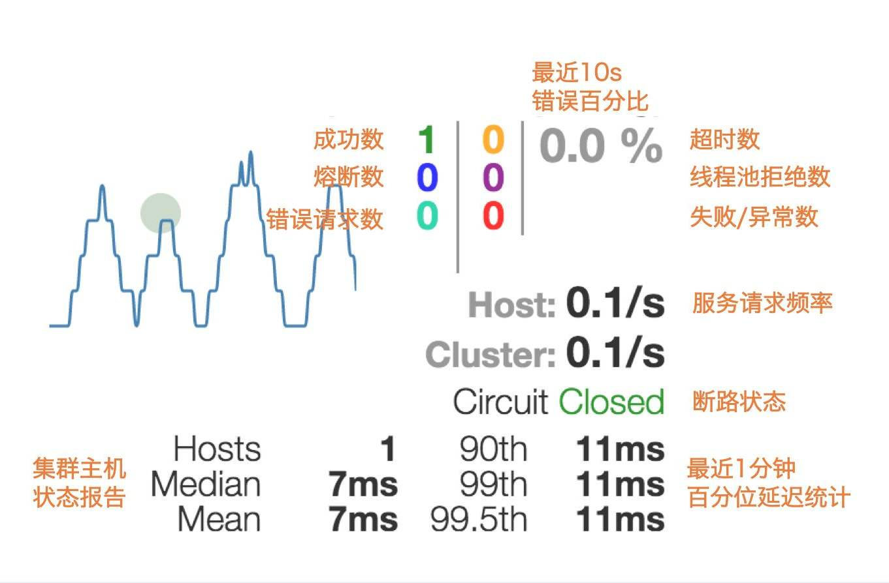
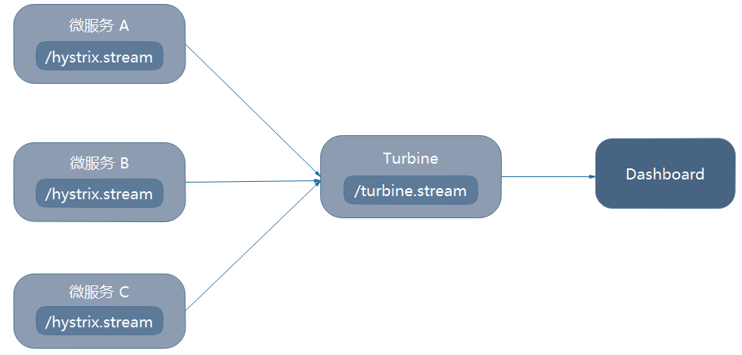
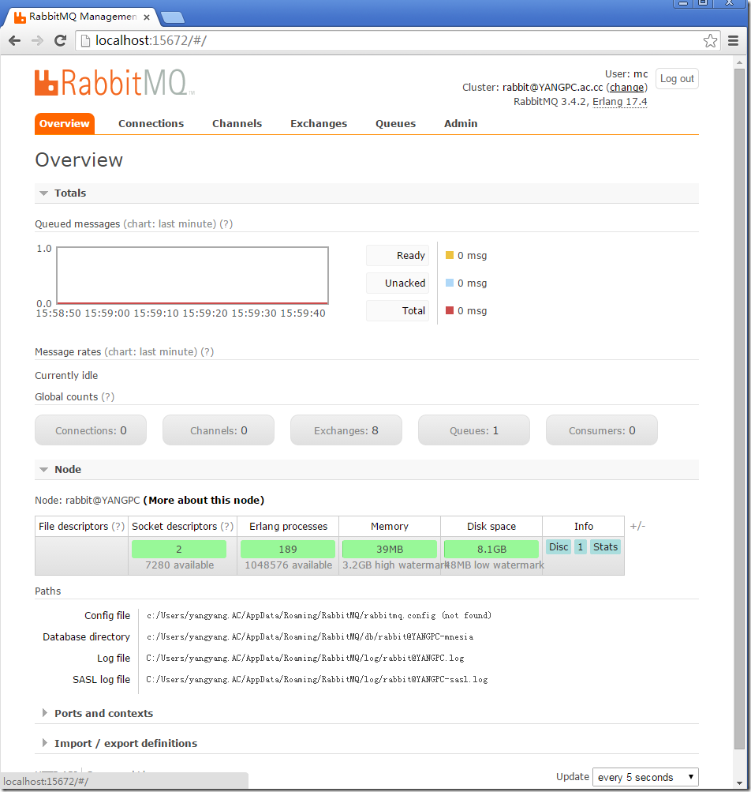

### 使用Hystrix实现微服务的容错处理


## 实现容错的手段

如果服务提供者响应非常缓慢，那么消费者对提供者的请求就会被强制等待，直到提供者响应或超时。在高负载场景下，如果不作任何处理，此类问题可能会导致服务消费者的资源耗竭甚至整个系统的崩溃。例如，曾经某个电子商务网站在一个黑色星期五发生过载，过多并发请求，导致用户支付请求延迟没有响应，等待很长时间后失败，支付失败导致用户重新刷新再次支付，进一步增加服务器负载，最终整个系统都崩溃了。

当依赖的服务不可用时，服务自身会不会被拖垮？这是需要考虑的问题。

##### 雪崩效应

微服务架构的应用系统通常包含多个服务层。微服务之间通过网路通信，从而支撑起整个应用。因此，微服务之间难免存在依赖关系。任何微服务都并非100%可用，网络往往也很脆弱，因此难免有些请求会失败。

我们常把 “基础服务故障” 导致 “级联故障” 的现象称为雪崩效应。雪崩效应描述的是提供者不可用导致消费者不可用，并将不可用逐渐放大的过程。



##### 如何容错

要想防止雪崩效应，必须有一个强大的容错机制。该机制需事先以下两点：

- 为网络请求设置超时：必须为网络请求设置超时。

  - 正常情况下，一个远程调用一般在几十毫秒内就能够得到响应。如果依赖的服务不可用或者网络有问题，那么响应时间就会变长。
  - 通常情况下，一次远程调用对应着一个线程/进程。如果响应太慢，这个线程/进程就得不到释放。如果得不到释放会越积越多，资源就会被逐渐耗尽，最终导致服务不可用。

  因此，必须为每个网络请求设置超时，让资源尽快释放。

- 使用断路器模式：

  试想一下，如果家里没有断路器，当电流过载时，电路不断开，电路就会升温，甚至可能烧断电路、引发火灾。使用断路器，电路一旦过载就会跳闸，从而保护电路安全。

  同理，如果对某个微服务的请求有大量超时，再去让新的请求访问该服务已经没有任何意义，只会无畏消耗资源。例如，设置了超时时间为1秒，如果短时间大量请求无法在1秒得到响应，就没必要再去请求依赖的服务了。

  断路器可以理解为对容易导致错误的操作的代理。这种代理能够统计一段时间内调用失败的次数，并决定时正常请求依赖的服务还是直接返回。

  断路器可以实现快速失败，如果在一段时间内检测到许多类似错误，会在之后的一段时间内，强迫对该服务调用快速失败，即不再请求所依赖的服务。这样，程序就无需再浪费CPU时间去等待长时间的超时。

  断路器也可自动诊断依赖的服务是否已经恢复正常，如果服务恢复正常，就会恢复请求该服务。使用这种方式，可实现微服务的 “自我修复”—当依赖的服务不正常时打开断路器快速失败，从而防止雪崩效应；当发现依赖的服务恢复正常时，又恢复请求。

  —正常情况下，断路器关闭，可正常请求依赖的服务

  —当一段时间内，请求失败率达到一定阈值（比如错误率达到50%），断路器会打开，此时，不再请求依赖的服务

  断路器状态转换图：

  

  —断路器打开一段时间后，会自动进入 “半开” 状态。此时。断路器可允许一个请求访问依赖的服务。如果该请求能够调用成功，则关闭断路器；否则继续保持打开状态

  至此，我们知道可以通过以上两种机制保护应用，从而防止雪崩效应并提升应用的可用性。

## 使用Hystrix实现容错

##### Hystrix简介

Hystrix是一个实现了超时机制和断路器模式的工具类库。

Hystrix时有Netflix开源的一个延迟和容错库，用于隔离访问远程系统、服务或者第三方库，防止级联失败，从而提升系统的可用性和容错性。

Hystrix主要通过以下几点实现延迟和容错：

- 包裹请求：使用HystrixCommand（或HystrixObservableCommand）包裹对依赖的调用逻辑，每个命令在独立线程执行。这使用到了设计模式的 “命令模式”
- 跳闸机制：当某服务的错误率超过一定阈值时，Hystrix可以自动或者手动跳闸，停止请求该服务一段时间。
- 资源隔离：Hystrix为每个依赖都维护了一个小型的线程池。如果该线程池已满，发生该依赖的请求会被立即拒绝，而不是失败等候，从而加速失败判定
- 监控：Hystrix可以近乎实时地监控运行指标和配置的变化，例如成功、失败、超时以及被拒绝的请求等
- 回退机制：当请求失败、超时、被拒绝，或当断路器打开时，执行回退逻辑。回退逻辑可有开发人员自行提供，例如返回一个缺省值
- 自我修复：断路器打开一段时间后，会自动进入 ”半开“ 状态

> Hystrix的GitHub：[https://github.com/Netflix/Hystrix](https://github.com/Netflix/Hystrix)
>
> 命令模式：[https://www.runoob.com/design-pattern/command-pattern.html](https://www.runoob.com/design-pattern/command-pattern.html)

##### 通用方式整合Hystrix

复制项目microservice-consumer-movie-ribbon，ArtifactId是microservice-consumer-movie-ribbon-hystrix

`为项目添加依赖：`

```xml
<dependency>
	<groupId>org.springframework.cloud</groupId>
	<artifactId>spring-cloud-starter-hystrix</artifactId>
</dependency>
```

`在启动类上添加注解@EnableCircuitBreaker或@EnableHystrix，为项目启动断路器支持`

`修改Controller，让其中的findById具备容错能力：`

```java
@RestController
public class MovieController {
	private static final Logger log = LoggerFactory.getLogger(MovieController.class);

	@Autowired
	private RestTemplate restTemplate;
	@Autowired
	private LoadBalancerClient LoadBalancerClient;
	
	@HystrixCommand(fallbackMethod = "findByIdFallback")
	@GetMapping("/user/{id}")
	public User findById(@PathVariable Long id) {
		return this.restTemplate.getForObject("http://microservice-provider-user/"+id, User.class);
	}
	
	public User findByIdFallback(Long id) {
		User user = new User();
		user.setId(-1L);
		user.setName("默认用户");
		return user;
	}
}
```

由以上代码可知，为findById方法编写了一个回退方法findByIdFallback，该方法与findById方法具有相同的参数与返回值类型，该方法返回了一个默认的User。

在findById方法上，使用注解@HystrixCommand的fallbackMethod属性，指定回退方法是findByIdFallback。注解@HystrixCommand由名为javanica(https://github.com/Netflix/Hystrix/tree/master/hystrix-contrib/hystrix-javanica)的Hystrix contrib库提供。javanica是一个Hystrix的子项目，用于简化Hystrix的使用。Spring Cloud自动将Spring bean与该注解封装在一个连接到Hystrix断路器的代理中。

@HystrixCommand的配置非常灵活，可使用注解@HystrixProperty的commandProperties属性类配置@HystrixCommand。例如：

```java
@HystrixCommand(fallbackMethod = "findByIdFallback", commandProperties = {
			@HystrixProperty(name = "execution.isolation.thread.timeoutInMilliseconds", value = "5000"),
			@HystrixProperty(name = "metrics.rollingStats.timeInMilliseconds", value = "10000") }, threadPoolProperties = {
					@HystrixProperty(name = "coreSize", value = "1"),
					@HystrixProperty(name = "maxQueueSize", value = "10")
			})
```

> @HystrixCommand详细了解：https://github.com/Netflix/Hystrix/tree/master/hystrix-contrib/hystrix-javanica#configuration
>
> Hystrix配置属性详情：https://github.com/Netflix/Hystrix/wiki/Configuration

启动Eureka。启动provider-user。启动Hystrix。访问http://localhost:8010/user/1可获得用户信息，此时停止provider-user服务，再次访问该地址，会得到回退方法findByIdFallback返回的默认用户信息。

##### Hystrix断路器的状态监控与深入理解

我们知道，当请求失败、被拒绝、超时或断路器打开时，都会进入回退方法。但进入回退方法并不意味着断路器已经被打开。那么如何才能明确了解断路器当前的状态呢？可使用Spring Boot Actuator

`引入Spring Boot Actuator：`

```xml
<dependency>
	<groupId>org.springframework.boot</groupId>
	<artifactId>spring-boot-starter-actuator</artifactId>
</dependency>
```

断路器的状态会暴露在Actuator提供的/health端点中，这样就可以直观地了解断路器的状态。

启动Eureka。启动provider-user。启动Hystrix。访问http://localhost:8010/user/1可获得用户信息，访问http://localhost:8010/health可以看到一串JSON字符串，其中最后会有

```json
"hystrix":{"status":"up"}
```

此时停止provider-user服务，再次访问该地址，会得到回退方法findByIdFallback返回的默认用户信息。接着访问http://localhost:8010/health会发现状态还是UP，这是因为失败率没有达到阈值（默认是5秒内20次失败）。这里再次强调—执行回退逻辑并不代表断路器已经打开。

持续快速访问http://localhost:8010/user/1，直到请求快速返回，这时访问http://localhost:8010/health可以看到Hystrix状态变成如下代码，状态是CIRCUIT_OPEN，说明断路器已经打开，不会再去请求服务了。也可使用类似的方法测试断路器从打开转半开以及从半开自动恢复等过程。

```json
"hystrix":{"status":"CIRCUIT_OPEN","openCircuitBreakers":["MovieController::findById"]}
```

##### Hystrix线程隔离策略与传播上下文

为了讲解这个问题，查看Hystrix官方的Wiki(https://github.com/Netflix/Hystrix/wiki/Configuration#execution.isolation.strategy)的文档。

Hystrix的隔离策有两种：分别是线程隔离和信号量隔离。

- THREAD(线程隔离)：使用该方式，HystrixCommand将会在单独的线程上执行，并发请求受线程池中的线程中线程数量的限制
- SEMAPHORE(信号量隔离)：使用该方式，HystrixCommand将会在调用线程上执行，开销相对较小，并发请求受到信号量个数的限制

Hystrix中默认并且推荐使用线程隔离(THREAD)，因为这种方式有一个除网络超时以外的额外保护层。

一般来说，只有当调用负载均衡非常高时（例如每个实例每秒调用数百次）才需要使用信号量隔离，因为这种场景下使用THREAD开销会比较高。信号量隔离一般仅适用于非网络调用的隔离。

可使用execution.isolation.strategy属性指定隔离策略。

了解Hystrix的隔离策略后，再来看一下Spring Cloud官方文档：

如果你想传播线程本地的上下文到@HystrixCommand，默认声明将不会工作，因为它会在线程池中执行命令（在超时情况下）。你可以使用一些配置，让Hystrix使用相同的线程，或者直接在注解中让Hystrix使用不同的隔离策略。例如：

```java
@HystrixCommand(fallbackMethod = "stuMyService", commandProperties={
    @HystrixProperty(name = "execution.isolation.strategy", value = "SEMAPHORE")
})
```

这也适用与使用@SessionScope或者@RequestSession的情况。你会知道什么时候需要这样做，因为会发生一个运行时异常，说它找不到作用域上下文(Scoped context)。

你还可将hystrix.shareSecurityContext属性设置为true，这样将会自动配置一个Hystrix并发策略插件的hook，这个hook会将SecurityContext从主线程传输到Hystrix的命令。因为Hystrix不允许注册多个Hystrix并发策略，所以可以声明HystrixConcurrencyStrategy为一个Spring bean来实现扩展。Spring Cloud会在Spring的上下文中查找你的实现，并将其包装在自己的插件中。

把Spring Cloud和Hystrix的文档对比阅读，就能很好地理解相关概念：

- Hystrix的隔离策略有THREAD和SEMAPHORE两种，默认是THREAD
- 正常情况下，保持默认即可
- 如果发生找不到上下文的运行时异常，可考虑将隔离策略设置为SEMAPHORE

##### Feign使用Hystrix

###### 为Feign添加回退

前面是使用注解@HystrixCommand的fallbackMethod属性实现回退的。然而，Feign是以接口形式工作的，它没有方法体，前面所使用的方式显然不适用于Feign。

那么Feign如何整合Hystrix呢？如何实现Feign的回退呢？

其实，Spring Cloud默认已为Feign整合了Hystrix，只要Hystrix在项目的classpath中，Feign默认就会用断路器包裹所有方法。下面详细探讨如何实现Feign的回退。

复制项目microservice-consumer-movie-feign，ArtifactId是microservice-consumer-movie-feign-hystrix-fallback。

`将之前编写的Feign的接口修改成如下内容：`

```java
/**
* Feign的fallback测试
* 使用@FeignClient的fallback属性指定回退类
*/
@FeignClient(name = "microservice-provider-user", fallback = FeignClientFallback.class)
public interface UserFeignClient {

	@RequestMapping(value = "/{id}", method = RequestMethod.GET)
	public User findById(@PathVariable("id") Long id);
}

```

```java
/**
* 回退类FeignClientFallback需实现Feign Client接口
*/
@Component
public class FeignClientFallback implements UserFeignClient{
    @Override
    public User findById(Long id){
        User user = new User();
        user.setId(-1L);
        user.setUsername("默认用户");
        return user;
    }
}
```

只须使用@FeignClient注解的fallback属性，就可指定名称的Feign客户端添加回退。

启动Eureka。启动provider-user。启动fallback。访问http://localhost:8010/user/1可获得用户信息。停止provider-user。再次访问该地址，会获得默认用户信息，说明当服务不可用时，进入了回退的逻辑。

###### 通过Fallback Factory检查回退原因

很多场景下，需要了解回退的原因，此时可使用注解@FeignClient的fallbackFactory属性。下面编写一个项目，为Feign打印回退日志。

复制项目microservice-consumer-movie-feign，ArtifactId是microservice-consumer-movie-feign-hystrix-fallback-factory。

`将UserFeignClient改为以下内容：`

```java
/**
* Feign的fallback测试
* 使用@FeignClient的fallback属性指定回退类
*/
@FeignClient(name = "microservice-provider-user", fallback = FeignClientFallbackFactory.class)
public interface UserFeignClient {

	@RequestMapping(value = "/{id}", method = RequestMethod.GET)
	public User findById(@PathVariable("id") Long id);
}
```

```java
/**
*UserFeignClient的fallbackFactory类，该类需要实现FallBackFactory接口，并覆写create方法
*/
@Component
public class FeignClientFallbackFactory implements FallbackFactory<UserFeignClient>{
	private static final Logger log = LoggerFactory.getLogger(FeignClientFallbackFactory.class);

	@Override
	public UserFeignClient create(Throwable cause) {
		return new UserFeignClient() {
			@Override
			public User findById(Long id) {
				log.info("fallback; reason was:", cause);
				User user = new User();
				user.setId(-1L);
		        user.setUsername("默认用户");
		        return user;
			}
		};
	}
}
```

启动Eureka。启动provider-user。启动factory。访问http://localhost:8010/user/1可获得用户信息。停止provider-user。再次访问该地址，会获得默认用户信息，并且控制台会输出log.info方法的日志信息。这样，当Feign回退时，会打印日志。

> fallbackFactory属性还有很多其他的用途，例如让不同的异常返回不同的回退结果，从而使Feign的回退更加灵活。例如：
>
> ```java
> @Component
> public class FeignClientFallbackFactory implements FallbackFactory<UserFeignClient>{
>     @Override
> 	public UserFeignClient create(Throwable cause) {
>         return new UserFeignClient() {
>             @Override
> 			public User findById(Long id) {
>                 User user = new User();
>                 if(cause instanceof IllegalArgumentException){
>                     user.setId(-1L);
>                 }else{
>                     user.setId(-2L);
>                 }
>                 return user;
>             }
>         }
>     }
> }
> ```
>
> 在特定的时间窗口中，create(Throwable cause)中的cause可能是null。这是Feign的Bug，该Bug在Feign9.4.0中已被解决。

###### 为Feign禁用Hystrix

前面说过，在Spring Cloud中，只要Hystrix在项目的classpath中，Feign就会使用断路器包裹Feign客户端的所有方法。这样虽方便，但很多场景下并不需要此功能。如何禁用呢？

借助Feign的自定义配置，可轻松为指定名称的Feign客户端禁用Hystrix。例如：

```java
@Configuration
public class FeignDisableHystrixConfiguration{
    @Bean
    @Scope("prototype")
    public Feign.Builder feignBuilder(){
        return Feign.builder();
    }
}
```

想要禁用Hystrix的@FeignClient引用该配置类即可，如：

```java
@FeignClient(name = "user", configuration = FeignDisableHystrixConfiguration.class)
public interface UserFeignClient{
}
```

也可为Feign全局禁用Hystrix。只须在application.yml中配置feign.hystrix.enabled = false即可。

## Hystrix的监控

除了实现容错外，Hystrix还提供了近乎实时的监控。HystrixCommand和HystrixObservableCommand在执行时，会生成执行结果和运行指标，比如每秒执行的请求书、成功数等，这些监控数据对分析应用系统的状态很有用。

使用Hystrix的模块hystrix-metrics-event-stream，就可将这些监控的指标信息与text/event-stream的格式暴露给外部系统。spirng-cloud-starter-hystrix已包含该模块，在此基础上，只须为项目添加spring-boot-starter-actuator，就可使用/hystrix.stream端点获得Hystrix的监控信息了。

前面的microservice-consumer-movie-ribbon-hystrix项目已具备监控Hystrix的能力。

启动Eureka。启动provider-user。启动hystrix。访问http://localhost:8010/hystrix.stream，可看到浏览器一直处于请求的状态，页面空白。这是因为此时项目中注解了@HystrixCommand的方法还没有被执行，因此也没有任何的监控数据。

访问http://localhost:8010/user/1后，再次访问http://localhost:8010/hystrix.stream，可看到页面会重复出现类似于以下的内容：

```json
data: {"type":"HystrixCommand","name":"findById","group":"MovieController"...}
```

这是因为系统会不断地刷新以获得实时的监控数据。Hystrix的监控指标非常全面，例如HystrixCommand的名称、group名称、断路器状态、错误率、错误数等。

###### Feign项目的Hystrix监控

启动之前的microservice-consumer-movie-feign-hystrix-fallback项目，并使用类似的方式测试，让后访问http://localhost:80110/hystrix.stream，发现返回的是404。这是因为项目连hystrix-metrics-event-stream的依赖都没有。

复制项目microservice-consumer-movie-feign-hystrix-fallback，ArtifactId是microservice-consumer-movie-feign-hystrix-fallback-stream。

`为项目添加spring-cloud-starter-hystrix的依赖：`

```xml
<dependency>
	<groupId>org.springframework.cloud</groupId>
	<artifactId>spring-cloud-starter-hystrix</artifactId>
</dependency>
```

在启动类上添加@EnableCircuitBreaker，这样就可使用/hystrix.stream端点监控Hystrix了。

## 使用Hystrix Dashboard可视化监控数据

前面使用/hystrix.stream端点获得的数据是以文字展示的，很难通过这些数据，一眼看出系统当前的运行状态。可使用Hystrix Dashboard，从而让监控数据图形化、可视化。

创建maven项目，项目名称是microservice-hystrix-dashboard

为项目添加如下依赖（Spring Boot和Cloud的依赖于之前项目一致）：

```xml
<dependency>
	<groupId>org.springframework.cloud</groupId>
	<artifactId>spring-cloud-starter-hystrix-dashboard</artifactId>
</dependency>
```

`启动类上添加@EnableHystrixDashboard：`

```java
@SpringBootApplication
@EnableHystrixDashboard
public class HystrixDashboardApplication {

	public static void main(String[] args) {
		SpringApplication.run(HystrixDashboardApplication.class, args);
	}
}
```

`配置文件添加端口：`

```yml
server:
  port: 8030
```

这样，一个简单的Hystrix Dashboard就完成了。访问http://localhost:8030/hystrix，可以看到Hystrix Dashboard的主页。



再将之前的项目启动，在URL栏输入http://localhost:8010/hystrix.stream，随意设置一个Title，点击Monitor Stream可看到类似页面：



aHService为方法名，helloService为类名，可以看到详细展示了这个HystrixCommand的各种指标，各个指标所代表的含义为：



> 简单起见，没有将Hystrix Dashboard注册到Eureka Server上。生产环境中，也可将Hystrix Dashboard注册到Server，更方便的管理Hystrix Dashboard。

## 使用Turbine聚合监控数据

前面使用/hystrix.stream端点监控单个微服务实例。然而，使用微服务架构的应用系统一般包含若干个服务，每个服务通常部署多个实例。如果每次只能看单个实例的数据，须在Hystrix Dashboard上切换想要监控的地址，显然这很不方便。

##### Turbine简介

Turbine时一个聚合Hystrix监控数据的工具，可将所有相关/hystrix.stream端点的数据聚合到一个组合的/turbine.stream中，从而让集群的监控更加方便。

Turbine架构如图：



> Turbine的GitHub：[https://github.com/Netflix/Turbine](https://github.com/Netflix/Turbine)

##### 使用Turbine监控多个微服务

为了让Turbine监控2个以上的服务，先将项目microservice-consumer-movie-feign-hystrix-fallback-stream的application.yml改成如下：

```yml
server:
  port: 8020
spring:
  application:
    name: microservice-consumer-movie-feign-hystrix-fallback-stream
eureka:
  client:
    serviceUrl:
      defaultZone: http://localhost:8761/eureka/
  instance:
    prefer-ip-address: true
```

创建maven项目，项目名称是microservice-hystrix-turbine，为项目添加以下依赖（Spring Boot和Cloud的依赖于之前项目一致）：

```xml
<dependency>
	<groupId>org.springframework.cloud</groupId>
	<artifactId>spring-cloud-starter-turbine</artifactId>
</dependency>
```

`启动类添加@EnableTurbine：`

```java
@SpringBootApplication
@EnableTurbine
public class TurbineApplication {

	public static void main(String[] args) {
		SpringApplication.run(HystrixDashboardApplication.class, args);
	}
}
```

`配置文件application.yml：`

```yml
server:
  port: 8031
spring:
  application:
    name: microservice-hystrix-turbine
eureka:
  client:
    serviceUrl:
      defaultZone: http://localhost:8761/eureka/
  instance:
    prefer-ip-address: true
turbine:
  appConfig: microservice-consumer-movie,microservice-consumer-movie-feign-hystrix-fallback-stream
  clusterNameExpression: "'default'"
```

以上配置，Turbine会在Eureka Server中找到movie和stream这两个服务，并聚合两个服务的监控数据。

启动Eureka，provider-user，ribbon-hystrix，feign-hystrix-fallback-stream，hystrix-turbine，hystrix-dashboard。

访问http://localhost:8010/user/1，让ribbon-hystrix服务产生监控数据。

访问http://localhost:8020/user/1，让feign-hystrix-fallback-stream服务产生监控数据。

打开Hystrix Dashboard首页http://localhost:8030/hystrix.stream，在URL填写http://localhost:8031/turbine.stream，随意指定Title并点击Monitor Stream可以查看监控的数据。

##### 使用消息中间件收集数据

一些场景下，前面的方式无法正常工作（例如服务于Turbine网络不通），此时，可借助消息中间件实现数据收集。各个服务将Hystrix Command的监控数据发送至消息中间件，Turbine消费中间件的数据。

###### 安装RabbitMQ

- 安装Erlang/OTP：RabbitMQ依赖Erlang，通过官方下载https://www.erlang.org/downloads，获取exe安装包
- 安装RabbitMQ Server：通过官方下载https://www.rabbitmq.com/install-windows.html，获取exe安装包
- 安装完成，在"计算机-管理-服务和应用程序-服务"中，查看是否有RabbitMQ的服务

###### 安装RabbitMQ管理插件

为了方便管理RabbitMQ，安装RabbitMQ的管理插件。

- 将目录切换到RabbitMQ中的sbin目录，例如：

  ```
  cd D:\rown\RabbitMQ Server\rabbitmq-server-3.6.6\sbin
  ```

- 执行以下命令，安装管理插件：

  ```
  rabbitmq-plugins enable rabbitmq_management
  ```

- 访问http://localhost:15672/，输入默认账号guest，密码guest，即可看到首页：

  

###### 改造微服务

复制项目microservice-consumer-movie-ribbon-hystrix，ArtifactId是microservice-consumer-movie-ribbon-hystrix-turbine-mq

`添加以下依赖：`

```xml
<dependency>
	<groupId>org.springframework.cloud</groupId>
	<artifactId>spring-cloud-netflix-hystrix-stream</artifactId>
</dependency>
<dependency>
	<groupId>org.springframework.cloud</groupId>
	<artifactId>spring-cloud-starter-stream-rabbit</artifactId>
</dependency>
```

`配置文件添加内容：`

```yml
spring:
  rabbitmq:
    host: localhost
    port: 5672
    username: guest
    password: guest
```

###### 改造Turbine

复制项目microservice-hystrix-turbine，ArtifactId是microservice-hystrix-turbine-mq

`添加以下依赖：`

```xml
<dependency>
	<groupId>org.springframework.cloud</groupId>
	<artifactId>spring-cloud-starter-turbine-stream</artifactId>
</dependency>
<dependency>
	<groupId>org.springframework.cloud</groupId>
	<artifactId>spring-cloud-starter-stream-rabbit</artifactId>
</dependency>
```

`同时删除：`

```xml
<dependency>
	<groupId>org.springframework.cloud</groupId>
	<artifactId>spring-cloud-starter-turbine</artifactId>
</dependency>
```

`修改启动类，将注解@EnableTurbine修改为@EnableTurbineStream`

`修改配置文件application.xml，添加以下内容：`

```yml
spring:
  rabbitmq:
    host: localhost
    port: 5672
    username: guest
    password: guest
```

`同时删除：`

```yml
turbine:
  appConfig: microservice-consumer-movie,microservice-consumer-movie-feign-hystrix-fallback-stream
  clusterNameExpression: "'default'"
```

启动Eureka、provider-user、ribbon-hystrix-turbine-mq、hystrix-turbine-mq。

访问http://localhost:8010/user/1，可获得结果。访问http://localhost:8031/，会发现Turbine能够持续不断地显示监控数据。

> 在Spring Cloud Camden SR4中，依赖spring-cloud-starter-turbine不能与spring-cloud-starter-turbine-stream共存，否则启动时会报异常。不仅如此，这两个依赖使用的Turbine版本也不相同。