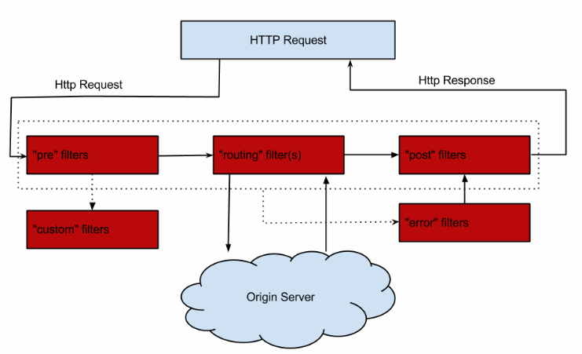
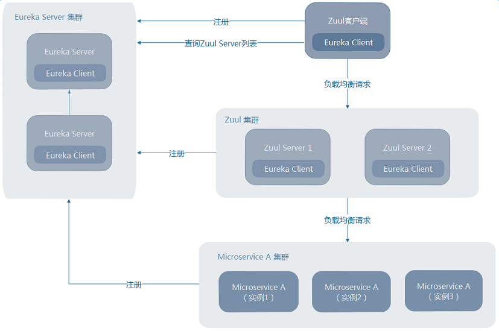
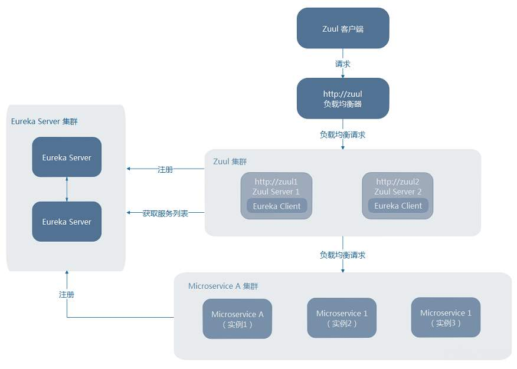

### 使用Zuul构建微服务网关


## 为什么要使用微服务网关

经过之前的文档学习，微服务架构初具雏形，但还有一些问题—不同微服务一般会有不同的网络地址，而外部客户端可能需要调用多个服务的接口才能完成一个业务需求。如果让客户端直接与各个微服务通信，会有以下问题：

- 客户端会多次请求不同的微服务，增加了客户端的复杂性
- 存在跨域请求，在一定场景下处理相对复杂
- 认证复杂，每个服务都需要独立认证
- 难以重构，随着项目迭代，可能需重新划分微服务。例如，可能将多个服务合并成一个或者将一个服务拆分成多个。如果客户端直接与微服务通信，那么重构将很难实施
- 某些微服务可能使用了防火墙/浏览器不友好的协议，直接访问会有一定的困难

以上问题可借助微服务网关解决。微服务网关时介于客户端和服务端之间的中间层，所有的外部请求都会先经过微服务网关。不仅如此，使用微服务网关还有以下优点：

- 易于监控：可在微服务网关收集监控数据并将其推送到外部系统进行分析
- 易于认证：可在微服务网关上进行认证，然后再讲请求转发到后端的微服务，而无须在每个服务中进行认证
- 减少了客户端与各个微服务之间的交互次数

## Zuul简介

Zuul是Netflix开源的微服务网关，它可以和Eureka、Ribbon、Hystrix等组件配合使用。Zuul的核心是一系列的过滤器，这些过滤器可完成以下功能：

- 身份认证与安全：识别每个资源的验证要求，并拒绝那些与要求不符的请求
- 审查与监控：在边缘位置追踪有意义的数据和统计结果，从而带来精确的生产视图
- 动态路由：动态地将请求路由到不同的后端集群
- 压力测试：逐渐增加指向集群的流量，以了解性能
- 负载分配：为每一种负载类型分配对应容量，并弃用超出限定值的请求
- 静态响应处理：在边缘位置直接建立部分响应，从而避免其转发到内部集群
- 多区域弹性：跨越AWS Region进行请求路由，旨在实现ELB(Elastic Load Balancing)使用的多样化，以及让系统的边缘更贴近系统的使用者

> Zuul的GitHub：https://github.com/Netflix/zuul
>
> Netflix如何使用Zuul：https://github.com/Netflix/zuul/wiki/How-We-Use-Zuul-At-Netflix

## 编写Zuul微服务网关

创建maven工程，ArtifactId是microservice-gateway-zuul。为项目添加以下依赖（Spring Boot和Cloud的依赖于之前项目一致）：

```xml
<dependency>
	<groupId>org.springframework.cloud</groupId>
	<artifactId>spring-cloud-starter-zuul</artifactId>
</dependency>
<dependency>
	<groupId>org.springframework.cloud</groupId>
	<artifactId>spring-cloud-starter-eureka</artifactId>
</dependency>
```

在启动类上添加注解@EnableZuulProxy，声明一个Zuul代理。该代理使用Ribbon来定位注册在Eureka Server中的微服；同时，该代理还整合了Hystrix，从而实现了容错，所有经过Zuul的请求都会在Hystrix命令中执行

```java
@SpringBootApplication
@EnableZuulProxy
public class ZuulApplication {

	public static void main(String[] args) {
		SpringApplication.run(ZuulApplication.class, args);
	}
}
```

编写配置文件：

```yml
server:
  port: 8040
spring:
  application:
    name: microservice-gateway-zuul
eureka:
  client:
    service-url:
      defaultZone: http://localhost:8761/eureka/
```

启动Eureka、provider-user、movie-ribbon、zuul。

访问http://localhost:8040/microservice-consumer-movie/user/1，请求会被转发到http://localhost:8010/user/1

访问http://localhost:8040/microservice-provider-user/1，请求会被转发到http://localhost:8000/1

默认情况下，Zuul会代理所有注册到Eureka Server的微服务，并且Zuul的路由规则如下：

```
http://ZUUL_HOST:ZUUL_ROOT/微服务在Eureka上的serviceId/** 会被转发到serviceId对应的微服务
```

启动Eureka、通过修改provider-user端口启动多个实例、启动zuul。

多次访问http://localhost:8040/microservice-provider-user/1，会发现两个provider-user服务会打印Hibernate开头的日志，说明可以使用Ribbon达到负载均衡的效果。

## Zuul的路由端点

当@EnableZuulProxy与Spring Boot Actuator配合使用时，Zuul会暴露一个路由管理端点/routes。借助这个端点，可以方便、直观地查看以管理Zuul的路由。

/routes端点的使用非常简单，使用GET方法访问该端点，即可返回Zuul当前映射的路由列表；使用POST方法访问该端点就会强制刷新Zuul当前映射的路由列表。

由于spring-cloud-starter-zuul已经包含了spring-boot-starter-actuator，因此之前编写的microservice-gateway-zuul已具备路由管理的能力。

启动Eureka、provider-user、consumer-movie、zuul。

访问http://localhost:8040/routes，可获得以下的结果：

```json
{
	"/microservice-provider-user/**": "microservice-provider-user",
	"/microservice-consumer-movie/**": "microservice-consumer-movie"
}
```

从中可以直观地看出从路径到微服务的映射，也可使用类似方式测试Zuul路由的自动刷新与强制刷新。

## 路由配置详解

前面编写了一个简单的Zuul网关，并让该网关代理了所有注册到Eureka Server的微服务。但在现实中可能只想让Zuul代理部分微服务，又或者需要对URL进行更加精确的控制。

`自定义指定微服务的访问路径，配置zuul.routes.指定微服务的serviceId = 指定路径即可：`

```yml
zuul:
  routes:
    microservice-provider-user: /user/**
```

这样设置，microservice-provider-user微服务就会被映射到/user/**路径。

`忽略指定微服务，配置zuul.ignored-services配置需忽略的服务，多个使用逗号分隔：`

```yml
zuul:
  ignored-services: microservice-provider-user,microservice-consumer-movie
```

这样就可让Zuul忽略microservice-provider-user和microservice-consumer-movie微服务，只代理其他服务。

`忽略所有微服务，只用路由指定微服务，将zuul.ignored-services设为'*'：`

```yml
zuul:
  ignored-services: '*' #使用'*'可忽略所有微服务
  routes:
    microservice-provider-user: /user/**
```

这样就可让Zuul指定代理microservice-provider-user微服务

`同时指定微服务的serviceId和对应路径：`

```yml
zuul:
  routes:
    user-route: #该配置方式，user-route只是给路由一个名称，可任意起名
      service-id: provider-microservice-user
      path: /user/** #service-id对应的路径
```

`同时指定path和URL：`

```yml
zuul:
  routes:
    user-route: 
      url: http://localhost:8000/ #指定的url
      path: /user/** #url对应的路径
```

这样可将/user/**映射到http://localhost:8000/\*\*，需要注意的是，使用这种方式配置的路由不会作为HystrixCommand执行，同时也不能使用Ribbon来负载均衡多个URL。

`同时指定path和URL，并且不破坏Zuul的Hystrix、Ribbon特性：`

```yml
zuul:
  routes:
    user-route:
      path: /user/**
      service-id: provider-microservice-user
ribbon:
  eureka:
    enabled: false #为Ribbon禁用Eureka
microservice-provider-user:
  ribbon:
    listOfServers: localhost:8000,localhost:8001
```

这样可即指定path与URL，又不破坏Zuul的Hystrix与Ribbon特性了。

`使用正则表达式指定Zuul的路由匹配规则，借助PatternServiceRouteMapper，实现从微服务到映射路由的正则配置：`

```java
@Bean
public PatternServiceRouteMapper serviceRouteMapper(){
    //调用构造函数PatternServiceRouteMapper(String servicePattern, String routePattern)
    //servicePattern指定微服务的正则
    //routePattern指定路由正则
    return new PatternServiceRouteMapper("(?<name>^.+)-(?<version>v.+$)", "${version}/${name}");
}
```

`路由前缀：`

```yml
zuul:
  prefix: /api
  strip-prefix: false
  routes:
    microservice-provider-user: /user/**
```

`忽略某些路径：`

之前说了如何忽略微服务，但有时还需要更细粒度的路由控制。例如，想让Zuul代理某个微服务，同时又想保护该微服务的某些敏感路径。此时，可使用ignored-Patterns，指定忽略的正则：

```yml
zuul:
  ignoredPatterns: /**/admin/** #忽略所有包含/admin/的路径
  routes:
    microservice-provider-user: /user/**
```

这样可将microservice-provider-user微服务映射到/user/**路径，但会忽略该微服务中所有包含/admin的路径。

> 如无法掌握Zuul路由的规律，可将com.netflix包的日志级别设为DEBUG。这样，Zuul会打印转发的具体细节，从而有助于更好理解Zuul的路由配置，例如：
>
> ```yml
> logging:
>   level:
>     com.netflix: DEBUG
> ```

## Zuul的安全与Header

##### 敏感Header的设置

一般来说，可在同一个系统中的服务之间共享Header。不过应尽量防止让一些敏感的Header外泄。因此，在很多场景下，需要通过路由指定一系列敏感Header列表。例如：

```yml
zuul:
  routes:
    microservice-provider-user:
      path: /users/**
      sensitive-headers: Cookie,Set-Cookie,Authorization
      url: https://downstream
```

也可用zuul.sensitive-headers全局指定敏感Header，例如：

```yml
zuul:
  sensitive-headers: Cookie,Set-Cookie,Authorization
```

需要注意的是，如果使用zuul.routes.*.sensitive-headers的配置方式，会覆盖掉全局的配置。

##### 忽略Header

可使用zuul.ignoredHeaders属性丢弃一些Header，例如：

```yml
zuul:
  ignored-headers: Header1,Header2
```

配置后，Header1和Header2将不会传播到其他的微服务中。

默认情况下，zuul.ignored-headers是空值，如果Spring Security在项目classpath中，该默认值是`Pragma,Cache-Control,X-Frame-Options,X-Content-Type-Options,X-XSS-Protection,Expires`。当Spring Security在项目classpath中，又需使用下游微服务的Spring Security的Header时，可将zuul.ignoreSecutiry-Headers设为false。

## 使用Zuul上传文件

对于小文件(1M以内)上传，无需任何处理。对于大文件(10M以上)上传，上传路径添加/zuul前缀。也可使用zuul.servlet-path自定义前缀。

如果Zuul使用了Ribbon做负载均衡，对于超大文件，需提升超时设置，例如：

```yml
hystrix.command.default.execution.isolation.thread.timeoutInMilliseconds: 60000
ribbon:
  ConnectTimeout: 3000
  ReadTimeout: 60000
```

创建maven项目，项目名称为microservice-file-upload。

`添加以下依赖(Spring Boot与Cloud自行添加)：`

```xml
<dependency>
    <groupId>org.springframework.boot</groupId>
    <artifactId>spring-boot-starter-web</artifactId>
</dependency>
<dependency>
    <groupId>org.springframework.cloud</groupId>
    <artifactId>spring-cloud-starter-eureka</artifactId>
</dependency>
<dependency>
    <groupId>org.springframework.boot</groupId>
    <artifactId>spring-boot-starter-actuator</artifactId>
</dependency>
```

`启动类添加@EnableEurekaClient注解`

`创建Controller：`

```java
@RestController
public class FileUploadController {
	
	@RequestMapping(value = "/upload", method = RequestMethod.POST)
	public String handleFileUpload(@RequestParam(value = "file", required = true) MultipartFile file) throws Exception {
		byte[] bytes = file.getBytes();
		File fileToSave = new File(file.getOriginalFilename());
		FileCopyUtils.copy(bytes, fileToSave);
		return fileToSave.getAbsolutePath();
	}
}
```

`在resources的static下创建index.html，并编写一个上传的form。创建首页跳转配置类：`

```java
@Configuration
public class IndexViewConfig extends WebMvcConfigurerAdapter{

	@Override
	public void addViewControllers(ViewControllerRegistry registry) {
		registry.addViewController("/").setViewName("forward:/index.html");
		registry.setOrder(Ordered.HIGHEST_PRECEDENCE);
		super.addViewControllers(registry);
	}
}
```

`配置文件application.yml：`

```yml
server:
  port: 8050
eureka:
  client:
    service-url:
      defaultZone: http://localhost:8761/eureka
  instance:
    prefer-ip-address: true
spring:
  application:
    name: microservice-file-upload
  http:
    multipart:
      #默认1M
      max-file-size: 2000Mb
      #默认10M
      max-request-size: 2500Mb
```

启动Eureka、file-upload、zuul服务。直接访问http://localhost:8050/选择文件上传。

通过zuul上传：将form提交地址改成http://localhost:8040/microservice-file-upload/upload即可。如果上传大文件，不添加/zuul前缀，会报FileUploadBase$FileSizeLimitExceededException异常。此时添加/zuul前缀，会报HystrixRuntimeException，此时已经不是文件大小限制的异常了，而是Hystrix的超时异常，此时将之前写的超时设置配置到application.yml中。

## Zuul的过滤器

##### 过滤器类型与请求生命周期

Zuul大部分功能通过过滤器实现。Zuul定义了4种标准过滤器类型，这些过滤器对应于请求的典型生命周期。

- PRE：过滤器在请求之前被路由调用。可实现身份验证、在集群中选择请求的微服务、记录调试信息等
- ROUTING：过滤器请求路由到微服务。用于构建发送给微服务的请求，并使用Apache HttpClient或Netflix Ribbon请求微服务
- POST：过滤器在路由到微服务以后执行。用来为响应添加标准的HTTP Header、收集统计信息和指标，将响应从微服务发送给客户端等
- ERROR：在其他阶段发生错误时执行

除默认过滤器，Zuul支持创建自定义的过滤器。例如，可定制一种STATIC类型过滤器，直接在Zuul中生成响应，而不将请求转发到后端的微服务。

Zuul请求的生命周期：



##### 编写Zuul过滤器

Zuul的过滤器非常简单，只须继承抽象类ZuulFilter，然后实现几个抽象方法即可。

复制microservice-gateway-zuul，项目名称改为microservice-gateway-zuul-filter

`编写自定义过滤器：`

```java
public class PreRequestLogFilter extends ZuulFilter {
	private static final Logger log = LoggerFactory.getLogger(PreRequestLogFilter.class);

	@Override
	public String filterType() {
		return "pre";
	}

	@Override
	public int filterOrder() {
		return 1;
	}

	@Override
	public boolean shouldFilter() {
		return true;
	}

	@Override
	public Object run() {
		RequestContext ctx = RequestContext.getCurrentContext();
		HttpServletRequest request = ctx.getRequest();
		log.info(String.format("send %s request to %s", request.getMethod(), request.getRequestURL().toString()));
		return null;
	}

}
```

- filterType：返回过滤器类型。有pre、route、post、error等几种取值，对应上面的几种过滤器
- filterOrder：返回int的值指定过滤器执行顺序，不同过滤器允许返回相同数字
- shouldFilter：返回boolean的值判断过滤器是否要执行，true表示执行
- run：过滤器具体逻辑

`启动类添加如下配置：`

```java
@Bean
public PreRequestLogFilter preRequestLogFilter() {
    return new PreRequestLogFilter();
}
```

启动Eureka、provider-user、zuul-filter。

访问http://localhost:8040/microservice-provider-user/1，获得打印出的日志说明过滤器被执行了。

##### 禁用Zuul过滤器

Spring Cloud默认为Zuul编写并启用了一些过滤器，如DebugFilter、FormBodyWrapperFilter等，都存放在spring-cloud-netflix-core这个jar包的org.springframework.cloud.netflix.zuul.filter中。

设置zuul.\<SimpleClassName>.\<filterType>.disable = true，即可禁用SimpleClassName对应的过滤器。如zuul.SendResponseFilter.post.disable = true 即可。

## Zuul的容错与回退

在Spring Cloud中，Zuul默认已经整合Hystrix。可以测试一下：

启动Eureka、provider-user、zuul、hystrix-dashboard。访问http://localhost:8040/hystrix.stream可获得监控数据。访问http://localhost:8030/hystrix，监控地址栏输入http://localhost:8040/hystrix.stream可看到监控的图表数据，说明所有经过Zuul的请求，都会被Hystrix保护起来。

##### Zuul添加回退

Zuul添加回退需实现ZuulFallbackProvider接口。在实现类中，指定为哪个微服务提供回退，并提供一个ClientHttpResponse作为回退响应。

复制microservice-gateway-zuul，项目名称改为microservice-gateway-zuul-fallback

`编写回退类：`

```java
@Component
public class UserFallbackProvider implements ZuulFallbackProvider {

	@Override
	public String getRoute() {
		// 表明为哪个微服务提供回退
		return "microservice-provider-user";
	}

	@Override
	public ClientHttpResponse fallbackResponse() {
		return new ClientHttpResponse() {

			@Override
			public HttpHeaders getHeaders() {
				// headers设定
				HttpHeaders httpHeaders = new HttpHeaders();
				MediaType mt = new MediaType("application", "json", Charset.forName("UTF-8"));
				httpHeaders.setContentType(mt);
				return httpHeaders;
			}

			@Override
			public InputStream getBody() throws IOException {
				// 响应体
				return new ByteArrayInputStream("用户微服务不可用，请稍后再试".getBytes());
			}

			@Override
			public String getStatusText() throws IOException {
				// 状态文本,此时返回的是OK
				return this.getStatusCode().getReasonPhrase();
			}

			@Override
			public HttpStatus getStatusCode() throws IOException {
				// fallback时的状态码
				return HttpStatus.OK;
			}

			@Override
			public int getRawStatusCode() throws IOException {
				// 数字类型状态码,此时返回的是200
				return this.getStatusCode().value();
			}

			@Override
			public void close() {
			}
		};
	}

}
```

启动Eureka、provider-user、zuul、hystrix-dashboard。访问http://localhost:8040/microservice-provider-user/1可正常获得结果，此时关闭provider-user服务，再次访问会在控制台输出响应体。

## Zuul的高可用

Zuul高可用非常关键，因外部请求到后端服务的流量都会经过Zuul。故而在生产环境一般需部署高可用的Zuul以避免单点故障。

##### Zuul客户端注册到Eureka Server上

这时Zuul的高可用非常简单，只须将多个Zuul节点注册到Eureka Server上，就可实现。

Zuul高可用架构图：



当Zuul客户端注册到Server上时，只须部署多个Zuul节点即可实现高可用。Zuul客户端会自动从Server中查询Zuul Server的列表，并使用Ribbon负载均衡地请求Zuul集群。

##### Zuul客户端未注册到Eureka Server

我们不可能让所有的服务都注册到Eureka Server上，这时可借助一个额外的负载均衡器来实现Zuul高可用，例如Nginx、HAProxy等。

Zuul高可用架构图：



Zuul客户端将请求发送到负载均衡器，负载均衡器将请求转发到其代理的其中一个Zuul节点。这样也可实现Zuul高可用。