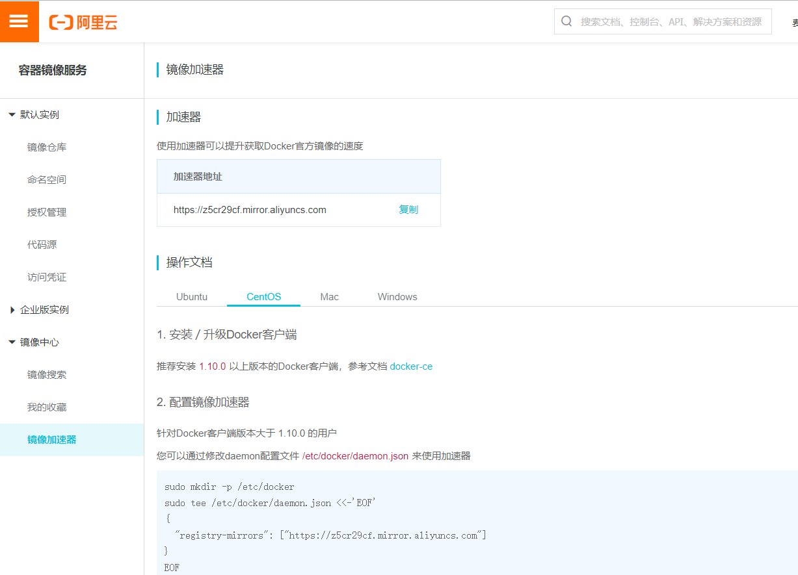

### Docker入门


## Docker简介

Docker是一个开源的容器引擎，有助于更快地交付应用。Docker可将应用程序和基础设施隔离，并能将基础设施当作程序一样进行管理。使用Docker，可更快地打包、测试以及部署应用程序，并可缩短从编写到部署运行代码的周期。

> Docker官网：https://www.docker.com/
>
> Docker的GitHub：https://github.com/docker/docker

## Docker的架构

Docker官方的架构图：


- Docker daemon(Docker守护进程)

  Docker daemon是一个运行在宿主机(DOCKER_HOST)的后台进程，可通过Docker客户端与之通信。

- Client(Docker客户端)

  Docker客户端是Docker的用户界面，可接受用户命令和配置标识，并与Docker daemon通信。

- Images(Docker镜像)

  Docker镜像是一个只读模板，包含创建Docker容器的说明。和系统安装光盘有点像—使用系统安装光盘可以安装系统，同理，使用Docker镜像可运行Docker镜像中的程序。

- Containers(容器)

  容器是镜像的可运行实例。这种关系类似于面向对象中类和对象的关系。可通过Docker API或者CLI命令来启停、移动、删除容器。

- Registry

  Docker Registry是一个集中存储与分发镜像的服务。构建完Docker镜像后，可在当前宿主机上运行。如果想要在其他服务器上运行，需要手动复制。此时可借助Docker Registry来避免镜像的手动复制。

  一个Docker Registry可包含多个Docker仓库，每个仓库包含多个镜像标签，每个标签对应一个Docker镜像。和Maven的仓库类似。如果比作Maven仓库的话，那么Docker仓库可理解为jar包的路径，镜像标签可理解为jar包版本。

  Docker Registry可分为公有Registry和私有Registry。最常用的是官方的Docker Hub，也是默认的Docker Registry。

## 安装Docker

Docker官方建议将Docker运行在Linux操作系统上。当然也可运行在其他平台，如Windows、Mac OS等。这里只将Docker安装在Linux上。其他操作系统的安装可参考官方文档：https://docs.docker.com/engine/installation/

##### 系统要求

- Docker运行在CentOS 7.X上
- Docker需要安装64位平台

##### 移除非官方软件包

Red Hat操作系统包含了一个旧版本的Docker软件包，该软件包名称是"docker"(新版是"docker-engine")。因此，如已安装该软件包，执行 `sudo yum -y remove docker`命令移除。

执行该命令只移除旧版Docker，/var/lib/docker目录的内容不会被删除，也就是旧版Docker创建的镜像、容器、卷等都会保留。

##### 设置Yum源

Docker有多种安装方式，如Yum安装、RPM安装、Shell安装等，这次使用Yum安装。

1. 安装yum-utils，这样能使用yum-config-manager工具设置Yum源。

   ```shell
   sudo yum install -y yum-utils
   ```

2. 添加Docker的Yum源，执行以下命令：

   ```shell
   sudo yum-config-manager \
   	 --add-repo \
   	 https://docs.docker.com/engine/installation/linux/repo_files/centos/docker.repo
   ```

3. 启用测试仓库。测试仓库包含在docker.repo文件中，默认是禁用的。

   如需启用执行以下命令：

   ```shell
   sudo yum-config-manager --enable docker-testing
   ```

   如需禁用执行以下命令：

   ```shell
   sudo yum-config-manager --disable docker-testing
   ```

##### 安装Docker

1. 更新Yum包的索引

   ```shell
   sudo yum makecache fast
   ```

2. 安装最新版Docker

   ```shell
   sudo yum -y install docker-engine
   ```

3. 有时可能需安装指定版本的Docker，可使用以下命令，即列出可用Docker版本：

   ```shell
   yum list docker-engine.x86_64 --showduplicates |sort -r
   ```

   sort -r表示对结果由高到低排序。执行会得到以下类似表格：

   ```
   docker-engine.x86_64      1.13.0-1.el7.centos       		docker-main
   docker-engine.x86_64      1.12.6-1.el7.centos       		docker-main
   docker-engine.x86_64      1.12.5-1.el7.centos       		docker-main
   ...
   ```

   第一列软件包名称，第二类版本字符串，第三列仓库名称。列出后，可使用以下命令安装指定版本Docker：

   ```shell
   sudo yum -y install docker-engine-<VERSION_STRING>
   如：
   sudo yum -y install docker-engine-1.13.0
   ```

4. 启动Docker

   ```shell
   sudo systemctl start docker
   ```

5. 执行以下命令，验证安装是否正确

   ```shell
   sudo docker run hello-world
   ```

   看到类似以下结果，说明安装正确：

   ```
   Unable to find image 'hello-word:latest' locally
   ...
   Hello for Docker!
This ....
   ```
   
6. 查看Docker版本

   ```shell
   docker version
   ```

   可看到类似以下结果：

   ```
   Client:
    Version:         1.13.1
    API version:     1.26
    Package version: docker-1.13.1-96.gitb2f74b2.el7.centos.x86_64
    Go version:      go1.10.3
    Git commit:      b2f74b2/1.13.1
    Built:           Wed May  1 14:55:20 2019
    OS/Arch:         linux/amd64
   
   Server:
    Version:         1.13.1
    API version:     1.26 (minimum version 1.12)
    Package version: docker-1.13.1-96.gitb2f74b2.el7.centos.x86_64
    Go version:      go1.10.3
    Git commit:      b2f74b2/1.13.1
    Built:           Wed May  1 14:55:20 2019
    OS/Arch:         linux/amd64
    Experimental:    false
   ```

##### 卸载Docker

1. 卸载Docker软件包

   ```shell
   sudo yum -y remove docker-engine
   ```

2. 如要删除镜像、容器、卷以及自定义配置文件，可执行以下命令

   ```shell
   sudo rm -rf /var/lib/docker
   ```

## 配置镜像加速器

国内访问Docker Hub的速度很不稳定，有时甚至出现连接不上的情况。可为Docker配置镜像加速器，从而解决这个问题。目前国内很多云服务商都提供了镜像加速的服务。

常用的镜像加速器有：阿里云加速器、DaoCloud加速器等。各厂商的镜像加速器使用方法类似，这里使用的是阿里云加速器。

注册阿里云账号后，访问该地址https://cr.console.aliyun.com/cn-hangzhou/instances/mirrors。会看到类似下图的页面：



按照操作文档即可配置镜像加速器。

## Docker常用命令

##### Docker镜像常用命令

- 搜索镜像

  ```
  docker search image-name
  ```

- 下载镜像

  ```
  docker pull image-name
  ```

- 列出镜像

  ```
  docker images
  ```

- 删除本地镜像

  删除指定名称的镜像

  ```
  docker rmi hello-word
  ```

  删除所有镜像

  ```
  docker rmi -f $(docker images)
  #-f 表示强制删除
  ```

> Docker的网络：https://docs.docker.com/engine/userguide/networking
>
> Docker的命令：https://docs.docker.com/engine/reference/commandline/docker/

##### Docker容器常用命令

- 启动容器

  ```
  docker run -d -p 91:80 image-name
  ```

- 列出容器

  ```
  docker ps
  docker ps -l #最近运行的容器
  docker ps -a #所有运行的容器
  ```

- 停止容器

  ```
  docker stop container_id
  ```

- 强制停止容器

  ```
  docker kill container_id
  ```

- 启动已停止的容器

  ```
  docker start container_id
  ```

- 重启容器

  ```
  docker restart container_id
  ```

- 进入容器

  ```
  docker exec -it container-id /bin/bash
  ```

- 删除容器

  ```
  docker rm container_id
  ```

- 删除所有容器

  ```
  docker rm -f $(docker ps -a -q)
  ```